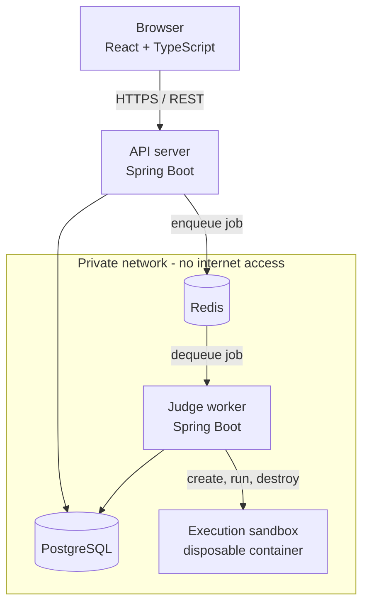
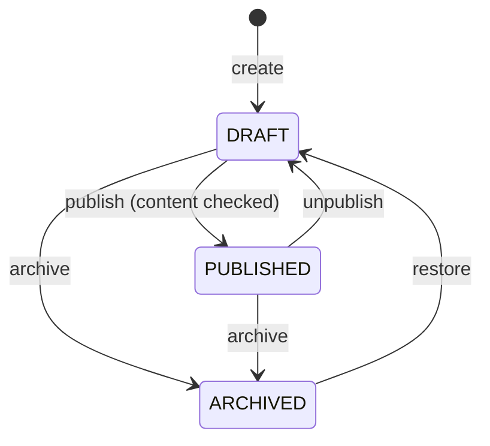
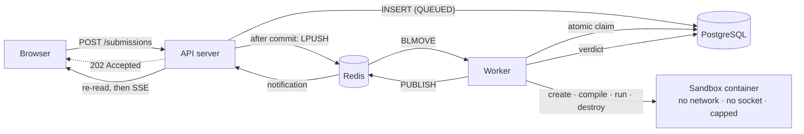
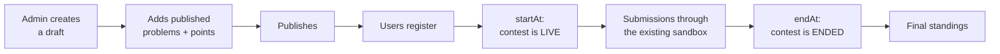

# CodeArena

An online judge platform: users solve algorithmic problems, submit code in C++, Java or
Python, and receive a verdict from a judge that compiles and runs their program inside a
disposable, network-isolated container under enforced CPU, memory and wall-clock limits.

The interesting part of this project is not the CRUD. It is everything around it —
asynchronous job processing, sandboxed execution of untrusted code, queue reliability,
idempotency and concurrency control.

> **Project status: Phase 7 of 16 complete and verified.** The judge works end to end: a
> submission is queued, claimed by a worker, compiled and run inside a hardened sandbox,
> given a verdict, and the result appears on the page without a reload — in practice and in
> timed contests, on a live scoreboard. C++, Java and Python. This README describes what
> exists today; it is updated at the end of every phase.
> Nothing below is aspirational — every claim here was executed, not assumed, including
> every verdict, which was produced by really compiling and running a program.
>
> **Live updates are best-effort, and the code says so.** Delivery is at-least-once, not
> exactly-once, and real-time delivery is not guaranteed; a snapshot on connect, a
> convergent client reducer and a bounded fallback poll are what make that safe. See
> [Live status](#live-status).
>
> **The sandbox is hardened, and it is still not a virtual machine.** Containers share the
> host kernel, so a kernel exploit escapes; and the execution service holds the Docker
> socket, which is host-equivalent if *that service* is compromised. Phase 6 moved the
> socket off the judge worker, narrowed the syscall surface, stripped the images and made
> every control verifiable — it did not eliminate either of those two facts.
> [docs/threat-model.md](docs/threat-model.md) is the honest account, including what is
> **not** protected. Do not put this on the public internet yet.

---

## Architecture



The rule the whole design serves: **the API server never executes user-submitted code.**
`POST /api/submissions` will persist a row, push a job onto Redis and return
immediately. All execution happens in a worker process, behind a queue, inside a
container that is destroyed afterwards.

See [docs/architecture.md](docs/architecture.md) for the component breakdown and
[docs/decisions.md](docs/decisions.md) for the engineering decisions and their
trade-offs.

---

## Tech stack

| Layer | Choice |
|---|---|
| Backend | Java 21, Spring Boot 3.5, Spring Web, Spring Data JPA, Actuator |
| Database | PostgreSQL 16, schema managed by Flyway |
| Cache / queue | Redis 7 (append-only persistence enabled) |
| Frontend | React 19, TypeScript, Vite, React Router, Axios |
| Execution | Docker: one disposable container per compile and per test run |
| Languages | C++ (g++ 13), Java (Temurin 21), Python 3.12 |
| Build | Maven 3.9 (multi-module reactor, wrapper committed), npm |
| API docs | OpenAPI 3 via springdoc, Swagger UI |
| Testing | JUnit 5, AssertJ, MockMvc, Testcontainers |

---

## Repository layout

```
codearena/
├── common/             Vocabulary shared by the services: languages, statuses, the
│                       submission event, and the execution API contract
├── backend/            Spring Boot API server (owns the Flyway migrations)
├── worker/             Spring Boot judge worker - no Docker access at all
├── executor/           Execution service - the ONLY holder of the Docker socket
├── sandbox/            Sandbox image definitions, the seccomp profile, and the
│                       script that builds the images
├── frontend/           React + TypeScript client
├── docs/               Architecture, threat model, contests and decision records
├── pom.xml             Maven aggregator
├── docker-compose.yml  Full local stack
└── .env.example        Configuration template
```

---

## Running the stack

### Prerequisites

| Tool | Version | Needed for |
|---|---|---|
| Docker + Compose | Engine 24+, Compose v2+ | the whole stack; also for integration tests |
| JDK | 21 | building or running the JVM services outside Docker |
| Node | 20+ | building or running the frontend outside Docker |

Maven is **not** a prerequisite — the committed wrapper (`./mvnw`) fetches the pinned
version itself.

### With Docker (recommended)

```bash
cp .env.example .env
# Set POSTGRES_PASSWORD and EXECUTOR_TOKEN - compose refuses to start without either.
#   openssl rand -hex 32

# Build the sandbox images. These are NOT compose services: they are the images the
# execution service creates throwaway containers from, and sandboxes are created with
# --pull never, so they must exist before anything can be judged.
./sandbox/build-images.sh

docker compose up --build
```

| Service | Where | Published to host |
|---|---|---|
| Frontend | http://localhost:5173 | yes |
| API | http://localhost:8080 | yes |
| Swagger UI | http://localhost:8080/swagger-ui.html | yes |
| API health | http://localhost:8080/actuator/health | yes |
| Worker health | `:8081/actuator/health` on the internal network | no — serves no public traffic |
| Executor health | `:8082/actuator/health` on the sandbox network | no — only the worker talks to it |
| PostgreSQL | `postgres:5432` on the internal network | no |
| Redis | `redis:6379` on the internal network | no |

PostgreSQL, Redis, the worker and the executor sit on networks declared `internal: true`.
Docker cannot publish a host port from such a network, which is the intended outcome.
The executor is on the `sandbox` network **only**, so the process holding the Docker socket
has no route to PostgreSQL or Redis at all. Inspect things from inside:

```bash
docker compose exec postgres psql -U codearena -d codearena
docker compose exec redis redis-cli
docker compose ps            # health of all six services
docker compose logs -f worker executor
docker compose down          # stop; add -v to discard the data volumes
```

The home page shows a live connectivity panel: if it reports the API server's name,
version and profile, the whole chain (browser → API → PostgreSQL → Redis) is working.

Startup is health-gated, not timing-based: the backend waits for PostgreSQL and Redis to
pass their health checks, and the worker waits for the backend (which applies the
migrations) and for the executor. The executor's health check fails while the Docker daemon
is unreachable **or while any sandbox image is missing**, so forgetting
`./sandbox/build-images.sh` shows up immediately as an unhealthy service rather than as a
run of failed submissions. All health checks probe `127.0.0.1` rather than `localhost`,
because in a container `localhost` can resolve to `::1` first and a server bound to IPv4
only then looks dead.

### Without Docker

Requires JDK 21, Node 20+, and your own PostgreSQL and Redis reachable on localhost —
the compose datastores cannot be used here, because they sit on an internal-only
network and publish no host port. Maven is **not** required: the committed Maven
Wrapper (`./mvnw`) downloads the pinned version.

The connection defaults in `application.yml` point at `localhost:5432` and
`localhost:6379`; override with `DATABASE_URL`, `DATABASE_USERNAME`,
`DATABASE_PASSWORD`, `REDIS_HOST` and `REDIS_PORT` if yours differ.

```bash
# API server on :8080
./mvnw -pl backend -am spring-boot:run

# Judge worker on :8081
./mvnw -pl worker -am spring-boot:run

# Frontend dev server on :5173
cd frontend && npm install && npm run dev
```

---

## Authentication

Accounts are protected by **server-side sessions stored in Redis**, delivered to the
browser as an HttpOnly cookie. There is no JWT, and no token is ever placed anywhere
JavaScript can read it.

That choice is deliberate. The client is a browser and there is one API server; the judge
worker never authenticates a user. A stateless token would buy nothing here and would cost
the property this system actually needs — immediate revocation. Signing out, or disabling
an abusive account, has to take effect now, not whenever a token happens to expire. Doing
that with JWT means a server-side denylist consulted on every request, which is a session
store with extra steps. The full trade-off, including what is given up, is in
[ADR-010](docs/decisions.md).

| Endpoint | Auth | Purpose |
|---|---|---|
| `POST /api/auth/register` | public | Create a `USER` account. Does not sign you in. |
| `POST /api/auth/login` | public | Authenticate by username **or** email; sets the session cookie. |
| `POST /api/auth/logout` | session | Destroys the session in Redis and clears the cookie. |
| `GET /api/auth/me` | session | The current account, or `401`. |

Authorisation rules, enforced by the server on every request:

| Path | Rule |
|---|---|
| `/api/system/info`, `/actuator/health/**`, `/v3/api-docs/**`, `/swagger-ui/**` | public |
| `/api/admin/**` | `ADMIN` only |
| `/actuator/**` (other than health) | `ADMIN` only |
| everything else under `/api/**` | any authenticated user |

The frontend's `ProtectedRoute` is a usability measure only. Bypassing it in the browser
yields an empty page and a `401` from the API — hiding a route is never what keeps it safe.

### Passwords

Length and screening, not composition rules, following NIST SP 800-63B: at least 10
characters, no requirement for a symbol-and-digit ritual that reliably produces
`Password1!`. A password may not contain the username or email local-part, and the most
frequently breached choices are screened out.

The upper bound is **72 bytes**, measured in UTF-8 rather than characters. BCrypt silently
ignores everything past 72 bytes, so a longer passphrase would be truncated without warning
and two passwords sharing a 72-byte prefix would both authenticate. Rejecting over-long
input is honest; quietly truncating it is not.

### Known gap

Login is **not yet rate limited**. BCrypt at cost 12 makes offline cracking expensive and
online guessing slow, but nothing currently stops sustained attempts against a single
account. Rate limiting arrives in Phase 9, where Redis is already the counter store. This
is stated plainly rather than filed under "future improvements", because it is a real gap
in what exists today.

---

## Problems

Administrators author problems; authenticated users browse the ones that are published.

### Lifecycle

A problem is never created already published, and status is never a writable field. It
moves only through explicit endpoints, each of which enforces the rules:



`ARCHIVED → DRAFT` is an addition to the four transitions the brief listed. Archiving is a
single click, and without a way back an administrator who archives the wrong problem has no
recourse short of editing the database. Restoring lands in DRAFT, never straight in
PUBLISHED, so a problem cannot silently reappear in the catalogue.

**Publication is gated on completeness.** A problem cannot be published without a
statement, an input and output format, constraints, at least one worked example and at
least one test case. The refusal names every field still missing, and the authoring API
surfaces the same list as `missingForPublication` so the UI can show it before anyone
presses Publish. Drafts, by contrast, may be as incomplete as the author likes — the
content columns are nullable precisely so a rough draft can be saved.

### Visibility

| Who | Sees |
|---|---|
| Anonymous | Nothing. Both problem endpoints require a session (`401`). |
| Authenticated user | PUBLISHED problems only |
| Administrator | Every status, through `/api/admin/problems` |

A DRAFT or ARCHIVED problem answers **404, not 403**, to a normal user. Answering
"forbidden" would confirm that a problem with that slug exists, which is exactly what an
unreleased problem is meant to withhold.

### Examples versus test cases

These are separate tables and separate response types, deliberately:

- **Examples** are public by definition — one exists in order to be read.
- **Test cases** are judge data. They are hidden by default, in the schema as well as the
  code, and are returned *only* by the admin API. For a hidden case the expected output is
  the answer key; publishing it would make an ACCEPTED verdict trivially forgeable once
  judging exists.

`ProblemDetailResponse`, the user-facing type, has **no field** that could hold a test
case, so leaking one would take a deliberate code change rather than a forgotten filter. A
test asserts the raw response body contains neither the hidden input nor its expected
output.

### Endpoints

| Endpoint | Auth | Purpose |
|---|---|---|
| `GET /api/problems` | session | Published catalogue, paged and filtered |
| `GET /api/problems/{slug}` | session | One published problem |
| `GET /api/admin/problems` | ADMIN | Every status; `status` is a filter here |
| `POST /api/admin/problems` | ADMIN | Create (always DRAFT) |
| `GET /api/admin/problems/{id}` | ADMIN | Authoring view, includes test cases |
| `PUT /api/admin/problems/{id}` | ADMIN | Update content |
| `POST /api/admin/problems/{id}/publish` | ADMIN | DRAFT → PUBLISHED |
| `POST /api/admin/problems/{id}/unpublish` | ADMIN | PUBLISHED → DRAFT |
| `POST /api/admin/problems/{id}/archive` | ADMIN | → ARCHIVED |
| `POST /api/admin/problems/{id}/restore` | ADMIN | ARCHIVED → DRAFT |

Admin endpoints address a problem by **UUID**; the public detail endpoint uses the
**slug**. A slug is editable, so hanging admin links off it would break them on a rename; a
UUID never changes. Sequential ids are never exposed. See ADR-015.

### Pagination

Zero-based `page`; `size` defaults to 20 and is **clamped** to 100 rather than rejected — a
client asking for 5000 rows is more often naive than hostile, and serving a sane page is
friendlier than a 400 while still refusing to read the whole table. A `size` below 1, or a
negative page, is a mistake with no sensible reading and is rejected.

`sort` accepts `NEWEST`, `OLDEST`, `TITLE` or `DIFFICULTY` — a closed vocabulary, not a
property name, so no caller can order by an arbitrary column. Every ordering ends with a
unique tiebreaker, without which rows sharing a sort key could appear on two consecutive
pages while another is skipped. Filtering, sorting and paging all happen in the database;
no more than one page of rows is ever materialised.

Filters: `difficulty`, `tag`, and `search` (case-insensitive substring of title or slug).

### Deferred, explicitly

Test cases are **stored** here; nothing executes them. There is no submission, no compiler,
no sandbox and no judge in this repository yet. Those are Phases 4 through 7.

---

## Submissions and judging

A user picks a language, writes a solution, and submits. The API writes a row, pushes an id
onto Redis, and returns in milliseconds — it never compiles or runs anything. A worker picks
the job up, claims it atomically, and judges it inside a disposable container.



### The endpoints

| Endpoint | Auth | Purpose |
|---|---|---|
| `POST /api/problems/{id}/submissions` | session | Queue a solution. Returns `202` with an id and `QUEUED`. |
| `GET /api/submissions/{id}` | session | Status, verdict and **your own** source. |
| `GET /api/submissions` | session | Your history, newest first. No source code. Filter by `problemId`, `status`, `language`; paginated. |
| `GET /api/submissions/{id}/events` | session | Live status as Server-Sent Events. Snapshot first, then changes, then the stream closes at the verdict. |

The stream runs the **same authorisation check as the endpoint beside it**, before the first
byte, and answers a bodiless `404` when it fails — the same answer `GET /api/submissions/{id}`
gives, so watching a stream discloses nothing that reading cannot.

The request body is two fields — `language` and `sourceCode`. There is no userId (it comes
from the session), no problemId (it comes from the path), and no status, verdict, runtime or
worker field, because those do not exist on the request type and therefore cannot be
overposted.

**Source code appears in the detail response and nowhere else.** A user reviewing their own
history needs to see what they wrote; a list of twenty submissions does not need a few
hundred kilobytes of program text, and the summary type has no field capable of carrying it.

### Verdicts

| Status | Meaning |
|---|---|
| `QUEUED` / `RUNNING` | In flight |
| `ACCEPTED` | Every test passed |
| `WRONG_ANSWER` | Output did not match on at least one test |
| `COMPILATION_ERROR` | The source did not compile |
| `RUNTIME_ERROR` | Exited non-zero, crashed, or was killed by a signal |
| `TIME_LIMIT_EXCEEDED` | Exceeded the problem's wall-clock budget |
| `MEMORY_LIMIT_EXCEEDED` | Killed by the kernel for exceeding its memory ceiling |
| `SYSTEM_ERROR` | The judge failed. Says nothing about the code. |

A verdict names *which* test failed and nothing about what it contained. The expected output
never enters the sandbox at all: only the input goes to stdin, and the comparison happens in
the worker — a program that could read the answer key could print it.

### Execution isolation

Every run is a fresh container. Every flag is assembled in one class, `SandboxPolicy`, so the
security boundary is a page you can read rather than something reconstructed from the middle
of process-handling code:

`--network none` · `--ipc none` · `--cgroupns private` · `--cap-drop ALL` ·
`--security-opt no-new-privileges` · `--security-opt seccomp=…` (a custom allowlist) ·
`--user 65534:65534` · `--memory` with swap disabled · `--cpus` · `--pids-limit` ·
`--ulimit fsize` · `--ulimit core=0` · `--ulimit nofile` · `--read-only` ·
`--tmpfs /tmp:noexec,nosuid,nodev,size=…` · `--pull never` · `--init` ·
`--hostname sandbox` · a fixed environment · no host mount · **no Docker socket**

**Every one of these is verified by running a real malicious program and checking what
happened** — a fork bomb, an allocation storm, a network probe, a DNS lookup, an environment
dump, a privilege-escalation attempt, a disk flood, a device probe, an orphaned child that
tries to outlive its timeout. Asserting that a flag appears in an argument list proves that a
string is in a list; it would keep passing if the daemon ignored the flag. Both kinds of test
exist, and only one of them is evidence.

No shell is involved anywhere. Commands are fixed argv arrays in `LanguageSpec`, and the
client chooses a language by sending an **enum constant** — a value that does not match one
is rejected before any code runs. There is no path by which a request contributes an element
to a command line.

Cleanup is layered, because a `finally` cannot cover a process that gets killed: containers
and volumes are removed on every path out of an execution, abandoned workspaces are closed on
a timer, and a reaper sweeps strays by label at startup and periodically.

### Who can create a container

One process, and it does nothing else.

Creating sandboxes means holding a Docker socket, and **a Docker socket is equivalent to root
on the host**. Until Phase 6 the holder was the judge worker — the same process that parses
untrusted program output and connects to PostgreSQL and Redis — so any bug anywhere in it was
a host compromise.

The socket now belongs to a separate **execution service** offering four operations: prepare
a workspace for one of three languages, compile it, run it, discard it. That contract has no
field for an image, a mount, a capability, a network, a user or a command, and the limits a
caller asks for are clamped on arrival. The worker holds a shared secret for it and nothing
else; its image no longer contains a Docker client at all.

So a compromised worker can ask for a program to be run in a sandbox. It cannot ask for
anything else.

**What that does not fix:** whatever holds the socket is host-equivalent if it is
compromised, and that is now the execution service. It is built to be a small target — no
database, no queue, no user model, one caller — but small is not zero. The real fixes are
rootless Docker or a runtime with its own kernel boundary, and neither is done. See ADR-028
and [docs/threat-model.md](docs/threat-model.md) §7.1.

### Sandbox images

Built here, not pulled: `sandbox/build-images.sh` builds three images from pinned base
**digests**, because a tag is rebuilt under the same name and an image that changes underneath
the judge changes what submissions are compiled against.

Each strips package managers, network and remote-access tooling, account-management tooling
and **every setuid/setgid bit** — the Debian gcc base ships thirteen, including `su`, `mount`
and `ssh-keysign`. The build *asserts* both: it fails if any setuid bit survives, and it
exercises the toolchain afterwards so an image stripped past the point of working fails to
build rather than failing every submission.

Containers are created with `--pull never`, so judging never reaches a registry. A missing
image is reported by the execution service's health check at startup.

### Delivery and recovery

**At-least-once, made safe by an idempotent claim.** Exactly-once is not offered because it
is not achievable — a worker can die between taking a job and recording that it did. Instead
a duplicate delivery is harmless: the claim is a single `UPDATE … WHERE status = 'QUEUED'`,
so of two workers racing, exactly one wins.

The **submission row is the outbox record** — no second table. `enqueued_at` marks
publication, which happens after commit (never before, or a worker could claim a row that
rolls back) and before the marker is written (so a crash republishes rather than silently
losing the job). A recovery sweeper republishes anything unpublished or stale and reclaims
submissions from workers that died holding a lease, giving up with `SYSTEM_ERROR` after three
attempts.

Retried: **infrastructure failures only**. A wrong answer, compilation error, runtime error
or timeout is a *result* — rerunning the same program would produce the same verdict and
simply burn a container.

Full detail, including the behaviour at every crash point, is in
[docs/submission-lifecycle.md](docs/submission-lifecycle.md).

### Output comparison

Line endings, trailing whitespace on each line, and trailing blank lines are normalised
away — those are properties of the author's editor, not their algorithm. Everything else is
exact: whitespace *within* a line, leading whitespace, and interior blank lines are all
significant. There is no floating-point tolerance, because applying an epsilon requires
knowing a problem's intended precision and the model has no field for it.

### Live status

The submission page updates itself. SSE is the primary transport and a bounded poll is the
fallback; both feed the same reducer, so whichever arrives first wins and the other is
discarded as a duplicate.

**What is guaranteed, precisely.** Delivery is **at-least-once and best-effort**. It is
**not exactly-once**, and real-time delivery is **not guaranteed** — Redis Pub/Sub retains
nothing, so an API instance that is restarting when a verdict is published simply does not
hear about it, and there is no replay. What holds the guarantee together instead:

- The worker publishes a **notification**, not state: submission id, status, timestamp. The
  API instance holding the stream **re-reads PostgreSQL** and sends the result of that read.
  The payload is never forwarded, so Redis is never asked what a submission's status is.
- Every stream's **first event is a snapshot** of current state, so a client that connects
  late or reconnects after a gap starts from the truth.
- The client reducer is **convergent**: an event applies only if strictly newer than what was
  already applied, and a terminal status absorbs everything after it. A duplicate is a no-op;
  a client that has seen `ACCEPTED` can never be walked back to `RUNNING`.
- If the stream fails, a **fallback poll** every 2.5 s takes over, and stops at the verdict.
  If nothing settles within five minutes the client stops and says so, rather than spinning.

When the stream is unavailable the page says live updates are unavailable and that it is
checking periodically. It does not pretend to be live when it is not.

### Per-test results

A verdict comes with a strip showing which tests passed, which failed, and which never ran —
judging stops at the first failure, and a test that never ran is not a test the program got
wrong.

`submission_test_results` stores a position, a pass flag, a runtime and a `hidden` marker.
**There is no column that could hold a test's input or expected output**, so there is nothing
to filter on the way out. A hidden test reports only whether it passed.

### Known gaps

- **Memory is enforced but not measured.** The ceiling is real — the kernel OOM killer
  produces `MEMORY_LIMIT_EXCEEDED`, and a test proves it — but nothing reports how much a
  program used, and `memoryKb` was removed from the API rather than shipped as a field that
  is always null. Measuring it needs a sandbox image we control (ADR-026).
- **Per-execution disk is not hard-bounded during compilation.** At run time it is fully
  contained — the workspace is read-only and the only writable filesystem is a size-capped
  tmpfs charged to the memory cgroup. During compilation the bound is `RLIMIT_FSIZE` per file
  plus the compile timeout, not a quota on total bytes. `--storage-opt size=` is deliberately
  **not** used: this daemon accepts it and silently does not enforce it (measured — a
  container capped at 64 MB wrote a 100 MB file), so configuring it would look like a limit
  while being none. ADR-031.
- **No AppArmor or SELinux.** Seccomp is applied; mandatory access control is not. This
  daemon reports no AppArmor at all, and naming a profile the host lacks makes every
  container fail to start, so it is applied only where a deployment genuinely has one.
- **A problem's time limit includes sandbox startup.** The enforced wall clock and the
  reported `runtimeMs` both cover the whole `docker run`, not just the program — and creating
  a container costs roughly **1.5 s on Docker Desktop/WSL2** (much less on a native Linux
  daemon). So a 2-second limit leaves well under a second of actual compute here, and a
  1-second limit is effectively unsatisfiable. Problem authors have to allow for it.

  Measured, so the cause is not guessed at: an empty Python program takes 1640 ms/run with no
  hardening flags at all and 1525 ms/run fully hardened with seccomp and `--init`. **The
  Phase 6 hardening costs nothing measurable**; the overhead is container creation itself.
  Charging only the program's own time would need a supervisor inside the sandbox image,
  which is a change to what a verdict means and is not in this phase.
- **The SSE connection cap is global, not per user.** 500 concurrent streams server-wide;
  one account can consume them all. Per-principal limits belong with rate limiting, Phase 9.
- **No submission rate limiting.** One authenticated user can submit as fast as they can
  issue requests, and each submission costs a container. The size limit and per-sandbox
  ceilings bound one submission's cost; nothing yet bounds the rate. Phase 9.
- **The sandbox is not production-hardened.** See the status note at the top and
  [docs/security.md](docs/security.md).


---

## Contests

An administrator schedules a contest, adds published problems and gives each a points
value. Users register, compete while it runs, and appear on a live scoreboard.



### Status is computed, not stored

Only the lifecycle an administrator chose — DRAFT, PUBLISHED or CANCELLED — is in the
database. UPCOMING, LIVE and ENDED are derived from that plus the schedule and the current
time, on every read.

That is not a stylistic preference. A stored status has to be advanced by something, and if
that something is down at `endAt`, or late, or the clock skews, the row says LIVE after the
contest is over and a late submission is accepted. Deriving it means **a contest ends on
time whether or not anything is running to notice**, and a restart cannot resurrect a
finished contest. There is no scheduler in this design and nothing to fall behind. ADR-032.

The window is half-open, `[startAt, endAt)`: at exactly `startAt` a contest is LIVE, and at
exactly `endAt` it is ENDED. Every instant belongs to exactly one state — an inclusive end
would leave one millisecond that is both, which is only ever found by the person whose
submission lands on it.

### The endpoints

| Endpoint | Auth | Purpose |
|---|---|---|
| `GET /api/contests` | session | The catalogue. Drafts are excluded by the query, for everyone. |
| `GET /api/contests/{id}` | session | One contest. **The problem list is empty until it starts.** |
| `POST /api/contests/{id}/register` | session | Registers the caller. No body: there is no field for another user. |
| `POST /api/contests/{id}/problems/{problemId}/submissions` | session | Submit during the contest. |
| `GET /api/contests/{id}/standings` | session | The scoreboard. |

Publishing announces that a contest exists and when — not what is in it. Releasing the
problem set during UPCOMING would let registered users read every statement in advance and
start solving before the clock did.

### Contest submissions are ordinary submissions

Same table, same status machine, same queue, same worker, same sandbox. A submission carries
a nullable `contest_id`; **null means practice**. There is no second execution engine,
because a second one would be a second place for a judging bug to live — and the one that
ran less often would be the one nobody noticed was broken.

Five things are checked server-side before a contest submission is accepted, none taken from
the request: the contest is visible, **the problem genuinely belongs to that contest**, the
caller is registered, the contest is LIVE *now*, and the problem is still published. Knowing
a problem's id is not authorisation to submit it to a contest.

### The deadline, and the countdown

The deadline is enforced on the server, against its own clock, on every submission. The page
draws a countdown and corrects it: the API sends `serverTime` alongside the schedule, so the
browser measures the offset between the two clocks once and counts down against a corrected
one — on a laptop resumed from sleep an uncorrected timer is routinely minutes wrong.

The countdown is **informational**. A browser still showing time remaining is refused all the
same, and scoring uses `submissions.created_at`, written by the database. No client timestamp
is read anywhere in the submission path, and none could be: the request type has no field for
one.

### Scoring

ICPC-style. A problem is solved by the **first** ACCEPTED submission to it; later submissions
change nothing, so resubmitting can neither help nor hurt.

```
score   = sum of the points of solved problems
penalty = for each SOLVED problem:
            minutes from the contest start to the solve
          + 20 × rejections made before that solve
```

Rejections on a problem you never solve are **free**, as are rejections after solving. The
first is the standard rule and the right one: penalising failed attempts would rank somebody
who tried a hard problem below an identical contestant who never tried.

**SYSTEM_ERROR is never counted.** It means the judge failed — a sandbox that would not
start, a daemon that went away — and the code was never shown to be wrong. Charging twenty
penalty minutes for our own outage would be the platform taking its failures out on the
people using it.

Standings order by score descending, then penalty ascending, then the earlier last solve,
then user id for stability. Ranks are competition ranks: genuine ties share a rank and the
next skips. The scoreboard carries a username, a rank, a score, a penalty and a grid — no
email, no internal identifier, no profile data, no source code.

It is recomputed from persisted submissions on every request. Nothing is stored and nothing
is cached, so no score can fall out of step with the submissions it came from and there is no
invalidation to miss. The aggregation runs in PostgreSQL and is bounded by
contestants × problems rather than by how many times people submitted. ADR-034.

### Immutability, cancellation and deletion

A contest is freely editable while DRAFT or UPCOMING and **frozen the moment it goes LIVE** —
schedule, problems, order and points alike. There is deliberately no override: changing what
a problem is worth mid-contest silently rewrites the standings of everyone who already solved
it.

**Cancelling is allowed even while a contest runs**, because a broken problem or a leaked test
set is a real reason to stop one. Submissions stop immediately, those already made are kept,
and the standings stay readable and marked cancelled. A cancelled contest is never
resurrected, and an ended one cannot be cancelled.

**Deletion is only for an untouched draft** — never published, nobody registered, nothing
submitted. The database enforces it independently (`ON DELETE RESTRICT`), so a mistake still
cannot destroy submission history. ADR-035.

### Known gaps

- **No plagiarism detection and no anti-cheat of any kind.** Nothing compares submissions
  between contestants or watches for collusion. A contest run on this platform is not
  protected against it. Stated plainly, because a judge that implied otherwise would be worse
  than one that says so.
- **No late registration.** Registration closes at `startAt`; a contestant joining late would
  compete over a shorter window while charged from the start, so their standing would not be
  comparable with anyone else's. ADR-033.
- **No scoreboard freeze.** Standings are live throughout, including the final hour.
- **No opt-out of standings, no team contests, no divisions, no ratings, no partial credit.**

Full detail is in [docs/contests.md](docs/contests.md).

---

## Configuration

No secret is committed and none is hardcoded. Every environment-specific value is read
from an environment variable with a development default; see
[.env.example](.env.example) for the full list.

| Variable | Purpose |
|---|---|
| `DATABASE_URL`, `DATABASE_USERNAME`, `DATABASE_PASSWORD` | PostgreSQL connection |
| `REDIS_HOST`, `REDIS_PORT`, `REDIS_PASSWORD` | Redis connection |
| `SESSION_TIMEOUT` | Idle lifetime of a session (ISO-8601, default `PT2H`) |
| `SESSION_COOKIE_SECURE` | Marks session and CSRF cookies `Secure`. **Must be `true` behind HTTPS** |
| `BCRYPT_STRENGTH` | Password hashing cost factor (default `12`) |
| `WORKER_CONCURRENCY` | Submissions judged in parallel per worker process |
| `CORS_ALLOWED_ORIGINS` | Explicit browser origin allow-list |
| `VITE_API_BASE_URL` | API base URL baked into the frontend bundle |

`docker-compose.yml` uses `${VAR:?message}` for `POSTGRES_PASSWORD`, so the stack fails
loudly rather than silently starting with a default credential. There is no token signing
key to manage: sessions live in Redis, so revoking one is a delete rather than a wait for
expiry.

---

## Testing

```bash
./mvnw test      # unit tests only - no Docker daemon required
./mvnw verify    # adds the integration suite (Testcontainers: real PostgreSQL + Redis)
```

Unit tests (`*Test`) run under Surefire and have no external dependencies. Integration
tests (`*IT`) run under Failsafe against real containers — never an in-memory database,
because the system depends on real PostgreSQL behaviour. See ADR-003.

Current suite: **315 tests** — 172 unit and 143 integration — plus **25 frontend tests**.

The integration tests run against real infrastructure throughout: a real PostgreSQL and
Redis via Testcontainers, and **real Docker containers** for every execution test. Mocking
the sandbox would have been easy and worthless — a mock can be made to return any outcome,
so the mapping from outcome to verdict would look correct while the sandbox did something
else entirely. Instead the programs are real, the containers are real, and the verdicts are
whatever actually happens: an infinite loop really is killed by the timeout, a runaway
allocation really is killed by the kernel, and a fork bomb really is contained by the pid
limit.

The integration tests drive real HTTP with a genuine cookie jar and CSRF handling rather
than Spring's `MockMvc` CSRF shortcut. That shortcut injects a valid token directly, so
the suite would still pass if the server never issued the CSRF cookie at all — which is
precisely the bug most likely to reach production.

Frontend:

```bash
cd frontend
npm test        # Vitest + Testing Library, jsdom
npm run lint
npm run build   # type-checks with tsc, then bundles
```

The frontend tests cover the two things worth testing here. The first is the **convergence
reducer**, which is where at-least-once delivery is actually made safe: every scenario the
transport can produce — a duplicate, a straggler arriving after the verdict, an event lost
entirely, an unparseable timestamp — is a case in `submissionStream.test.ts`, and the file
is the specification for the rule.

The second is that the verdict display **does not depend on colour** to say what happened,
and that a test result carries no field capable of holding test data. That last one asserts
the *shape* rather than the rendering, because the shape is the actual guarantee: a
component cannot leak a field that does not exist.

---

## Security posture

In place and verified as of Phase 1:

- **Network isolation.** PostgreSQL, Redis and the worker sit on a Docker network
  declared `internal: true`. Containers on it get no default route, so an outbound
  connection fails with `Network unreachable` — confirmed against a raw IP, not just a
  hostname. No host port is published for either datastore.
- **No secrets in the repository.** `.env` is git-ignored; only `.env.example` is
  committed, with placeholders. Compose refuses to start if `POSTGRES_PASSWORD` is unset
  rather than falling back to a default credential.
- **Passwords are BCrypt hashes at cost 12**, stored through a `DelegatingPasswordEncoder`
  so the algorithm can be migrated later without invalidating existing hashes. No endpoint
  can return a hash: responses are built from a closed record with no password field.
- **Sessions, not tokens.** The session id is an HttpOnly, SameSite=Lax cookie, so
  JavaScript cannot read it and an XSS bug does not hand over the account. Logging out
  destroys the session in Redis, verified by replaying the captured cookie and getting 401.
- **CSRF tokens** on every state-changing request, since the browser attaches the session
  cookie automatically.
- **Login does not leak which accounts exist**: a wrong password and an unknown username
  return an identical status and message, asserted by a test.
- **Containers run as a non-root user** (`uid=100 codearena`, confirmed at runtime),
  from a JRE-only runtime image carrying neither the JDK nor the build cache.
- **Errors leak nothing.** Stack traces are logged server-side and never serialised into
  a response; a unit test asserts the thrown exception's message is absent from the body.
- **CORS is an explicit origin allow-list**, never a wildcard.
- **Untrusted code runs only in a disposable container** with no network, no host mount, no
  Docker socket, dropped capabilities, a read-only root filesystem, an unprivileged user, and
  kernel-enforced CPU, memory and process ceilings.
- **The client cannot name a command.** The language is an enum constant; every compiler and
  interpreter command line is a compile-time argv array. No shell is involved anywhere.

**Not hardened, and stated as such:** the worker holds the Docker socket (host-root-equivalent
if the worker is compromised), containers share the host kernel, and submission rate limiting
does not exist yet. [docs/security.md](docs/security.md) covers each in full, with the
hardening work Phase 12 should do.
- **Browser hardening headers** — `X-Content-Type-Options`, `X-Frame-Options`,
  `Referrer-Policy` — asserted present on responses, not merely configured (see ADR-009
  for why that distinction mattered).

Designed for, but **not yet implemented**:

- **The API server never executes user code.** The topology enforcing this — a separate
  worker, behind a queue — exists; the sandbox that runs submissions in a disposable,
  resource-limited container arrives in Phase 6.

Authentication and authorisation arrive in Phase 2, the execution sandbox and its CPU,
memory and timeout limits in Phase 6, and rate limiting in Phase 9. Each is documented
as it lands, never before.

---

## Roadmap

| Phase | Scope | Status |
|---|---|---|
| 1 | Repository, build, Docker stack, service skeletons | **Complete** |
| 2 | Users, roles, sessions, registration and login | **Complete** |
| 3 | Problems, tags, test cases, search and pagination | **Complete** |
| 4 | Submissions, queue, worker, sandboxed execution, judging | **Complete** |
| 5 | Submission history, per-test results, real-time status | **Complete** |
| 6 | Secure execution, sandbox hardening, execution-service separation | **Complete** |
| 7 | Contests, participation and contest scoring | **Complete** |
| 8 | Worker scaling, caching, user profiles and statistics | Next |
| 9 | Rate limiting and abuse controls | Planned |
| 10 | Contests, scoring, leaderboards | Planned |
| 11 | Full frontend | Planned |
| 12 | Kernel-level sandbox isolation (gVisor / rootless daemon) | Planned |
| 13–16 | Testing, CI/CD, docs, deployment | Planned |

The Docker execution engine and the judging and verdict logic were originally sketched as
separate later phases. They were delivered in Phase 4, because a submission pipeline that
queues work nothing can execute is not testable and therefore not verifiable. The table
above reflects what was actually built, not the original guess at the order.

Phase 12 is deliberately still there. Phase 6 hardened the sandbox and moved Docker control
off the worker; it did not give containers their own kernel. That remains the one change
that would turn a container escape into something other than a host escape.

---

## Licence

[MIT](LICENSE)
