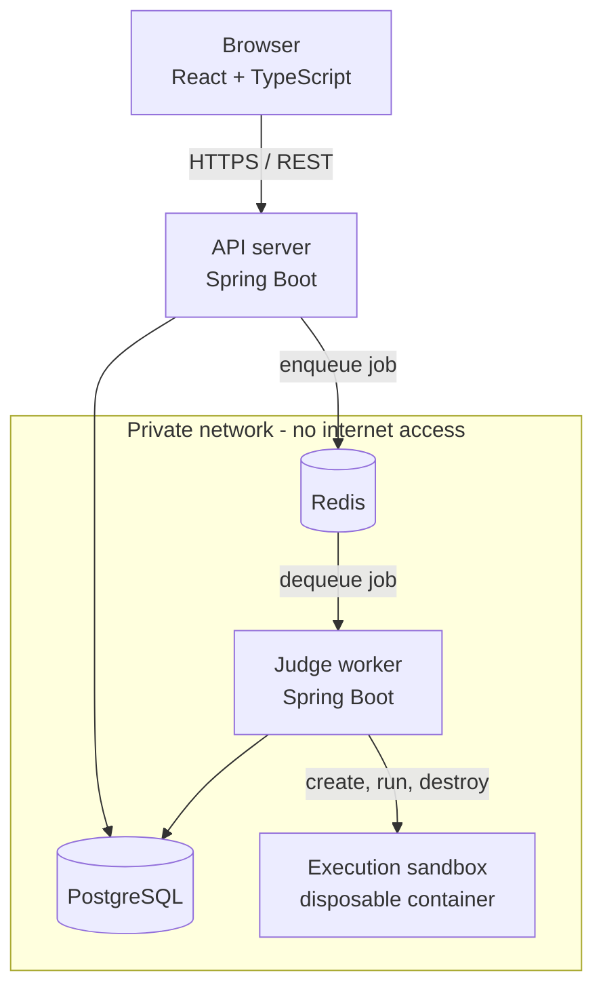
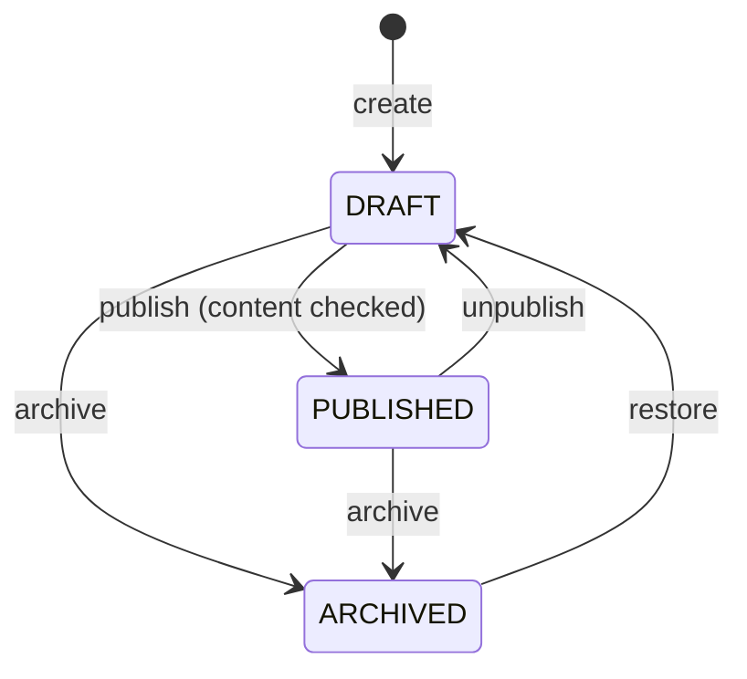
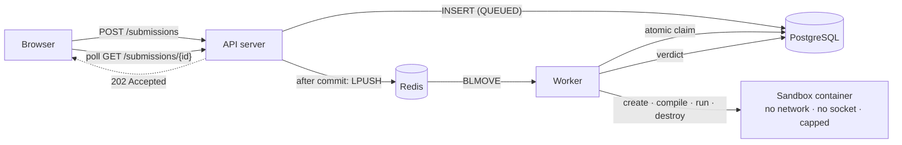

# CodeArena

An online judge platform: users solve algorithmic problems, submit code in C++, Java or
Python, and receive a verdict from a judge that compiles and runs their program inside a
disposable, network-isolated container under enforced CPU, memory and wall-clock limits.

The interesting part of this project is not the CRUD. It is everything around it —
asynchronous job processing, sandboxed execution of untrusted code, queue reliability,
idempotency and concurrency control.

> **Project status: Phase 4 of 16 complete and verified.** The judge works: a submission
> is queued, claimed by a worker, compiled and run inside a locked-down container, and
> given a verdict. C++, Java and Python. This README describes what exists today; it is
> updated at the end of every phase. Nothing below is aspirational — every claim here was
> executed, not assumed, including every verdict, which was produced by really compiling
> and running a program.
>
> **The sandbox is competent, not hardened.** The worker holds the Docker socket, which is
> host-root-equivalent if the worker itself is compromised, and containers share the host
> kernel. Both are stated plainly in [docs/security.md](docs/security.md) along with the
> hardening Phase 12 should bring. Do not put this on the public internet yet.

---

## Architecture



The rule the whole design serves: **the API server never executes user-submitted code.**
`POST /api/submissions` will persist a row, push a job onto Redis and return
immediately. All execution happens in a worker process, behind a queue, inside a
container that is destroyed afterwards.

See [docs/architecture.md](docs/architecture.md) for the component breakdown and
[docs/decisions.md](docs/decisions.md) for the engineering decisions and their
trade-offs.

---

## Tech stack

| Layer | Choice |
|---|---|
| Backend | Java 21, Spring Boot 3.5, Spring Web, Spring Data JPA, Actuator |
| Database | PostgreSQL 16, schema managed by Flyway |
| Cache / queue | Redis 7 (append-only persistence enabled) |
| Frontend | React 19, TypeScript, Vite, React Router, Axios |
| Execution | Docker: one disposable container per compile and per test run |
| Languages | C++ (g++ 13), Java (Temurin 21), Python 3.12 |
| Build | Maven 3.9 (multi-module reactor, wrapper committed), npm |
| API docs | OpenAPI 3 via springdoc, Swagger UI |
| Testing | JUnit 5, AssertJ, MockMvc, Testcontainers |

---

## Repository layout

```
codearena/
├── common/             Domain vocabulary shared by the API and the worker
├── backend/            Spring Boot API server (owns the Flyway migrations)
├── worker/             Spring Boot judge worker
├── frontend/           React + TypeScript client
├── docs/               Architecture and decision records
├── pom.xml             Maven aggregator
├── docker-compose.yml  Full local stack
└── .env.example        Configuration template
```

---

## Running the stack

### Prerequisites

| Tool | Version | Needed for |
|---|---|---|
| Docker + Compose | Engine 24+, Compose v2+ | the whole stack; also for integration tests |
| JDK | 21 | building or running the JVM services outside Docker |
| Node | 20+ | building or running the frontend outside Docker |

Maven is **not** a prerequisite — the committed wrapper (`./mvnw`) fetches the pinned
version itself.

### With Docker (recommended)

```bash
cp .env.example .env
# Set POSTGRES_PASSWORD - compose refuses to start without it.

docker compose up --build
```

| Service | Where | Published to host |
|---|---|---|
| Frontend | http://localhost:5173 | yes |
| API | http://localhost:8080 | yes |
| Swagger UI | http://localhost:8080/swagger-ui.html | yes |
| API health | http://localhost:8080/actuator/health | yes |
| Worker health | `:8081/actuator/health` on the internal network | no — serves no public traffic |
| PostgreSQL | `postgres:5432` on the internal network | no |
| Redis | `redis:6379` on the internal network | no |

PostgreSQL, Redis and the worker sit on a network declared `internal: true`. Docker
cannot publish a host port from such a network, which is the intended outcome: the
datastores are unreachable from the host and from the LAN. Inspect them from inside:

```bash
docker compose exec postgres psql -U codearena -d codearena
docker compose exec redis redis-cli
docker compose ps            # health of all five services
docker compose logs -f worker
docker compose down          # stop; add -v to discard the data volumes
```

The home page shows a live connectivity panel: if it reports the API server's name,
version and profile, the whole chain (browser → API → PostgreSQL → Redis) is working.

Startup is health-gated, not timing-based: the backend waits for PostgreSQL and Redis
to pass their health checks, and the worker additionally waits for the backend, because
the backend applies the database migrations. All five health checks probe `127.0.0.1`
rather than `localhost`, because in a container `localhost` can resolve to `::1` first
and a server bound to IPv4 only then looks dead.

### Without Docker

Requires JDK 21, Node 20+, and your own PostgreSQL and Redis reachable on localhost —
the compose datastores cannot be used here, because they sit on an internal-only
network and publish no host port. Maven is **not** required: the committed Maven
Wrapper (`./mvnw`) downloads the pinned version.

The connection defaults in `application.yml` point at `localhost:5432` and
`localhost:6379`; override with `DATABASE_URL`, `DATABASE_USERNAME`,
`DATABASE_PASSWORD`, `REDIS_HOST` and `REDIS_PORT` if yours differ.

```bash
# API server on :8080
./mvnw -pl backend -am spring-boot:run

# Judge worker on :8081
./mvnw -pl worker -am spring-boot:run

# Frontend dev server on :5173
cd frontend && npm install && npm run dev
```

---

## Authentication

Accounts are protected by **server-side sessions stored in Redis**, delivered to the
browser as an HttpOnly cookie. There is no JWT, and no token is ever placed anywhere
JavaScript can read it.

That choice is deliberate. The client is a browser and there is one API server; the judge
worker never authenticates a user. A stateless token would buy nothing here and would cost
the property this system actually needs — immediate revocation. Signing out, or disabling
an abusive account, has to take effect now, not whenever a token happens to expire. Doing
that with JWT means a server-side denylist consulted on every request, which is a session
store with extra steps. The full trade-off, including what is given up, is in
[ADR-010](docs/decisions.md).

| Endpoint | Auth | Purpose |
|---|---|---|
| `POST /api/auth/register` | public | Create a `USER` account. Does not sign you in. |
| `POST /api/auth/login` | public | Authenticate by username **or** email; sets the session cookie. |
| `POST /api/auth/logout` | session | Destroys the session in Redis and clears the cookie. |
| `GET /api/auth/me` | session | The current account, or `401`. |

Authorisation rules, enforced by the server on every request:

| Path | Rule |
|---|---|
| `/api/system/info`, `/actuator/health/**`, `/v3/api-docs/**`, `/swagger-ui/**` | public |
| `/api/admin/**` | `ADMIN` only |
| `/actuator/**` (other than health) | `ADMIN` only |
| everything else under `/api/**` | any authenticated user |

The frontend's `ProtectedRoute` is a usability measure only. Bypassing it in the browser
yields an empty page and a `401` from the API — hiding a route is never what keeps it safe.

### Passwords

Length and screening, not composition rules, following NIST SP 800-63B: at least 10
characters, no requirement for a symbol-and-digit ritual that reliably produces
`Password1!`. A password may not contain the username or email local-part, and the most
frequently breached choices are screened out.

The upper bound is **72 bytes**, measured in UTF-8 rather than characters. BCrypt silently
ignores everything past 72 bytes, so a longer passphrase would be truncated without warning
and two passwords sharing a 72-byte prefix would both authenticate. Rejecting over-long
input is honest; quietly truncating it is not.

### Known gap

Login is **not yet rate limited**. BCrypt at cost 12 makes offline cracking expensive and
online guessing slow, but nothing currently stops sustained attempts against a single
account. Rate limiting arrives in Phase 9, where Redis is already the counter store. This
is stated plainly rather than filed under "future improvements", because it is a real gap
in what exists today.

---

## Problems

Administrators author problems; authenticated users browse the ones that are published.

### Lifecycle

A problem is never created already published, and status is never a writable field. It
moves only through explicit endpoints, each of which enforces the rules:



`ARCHIVED → DRAFT` is an addition to the four transitions the brief listed. Archiving is a
single click, and without a way back an administrator who archives the wrong problem has no
recourse short of editing the database. Restoring lands in DRAFT, never straight in
PUBLISHED, so a problem cannot silently reappear in the catalogue.

**Publication is gated on completeness.** A problem cannot be published without a
statement, an input and output format, constraints, at least one worked example and at
least one test case. The refusal names every field still missing, and the authoring API
surfaces the same list as `missingForPublication` so the UI can show it before anyone
presses Publish. Drafts, by contrast, may be as incomplete as the author likes — the
content columns are nullable precisely so a rough draft can be saved.

### Visibility

| Who | Sees |
|---|---|
| Anonymous | Nothing. Both problem endpoints require a session (`401`). |
| Authenticated user | PUBLISHED problems only |
| Administrator | Every status, through `/api/admin/problems` |

A DRAFT or ARCHIVED problem answers **404, not 403**, to a normal user. Answering
"forbidden" would confirm that a problem with that slug exists, which is exactly what an
unreleased problem is meant to withhold.

### Examples versus test cases

These are separate tables and separate response types, deliberately:

- **Examples** are public by definition — one exists in order to be read.
- **Test cases** are judge data. They are hidden by default, in the schema as well as the
  code, and are returned *only* by the admin API. For a hidden case the expected output is
  the answer key; publishing it would make an ACCEPTED verdict trivially forgeable once
  judging exists.

`ProblemDetailResponse`, the user-facing type, has **no field** that could hold a test
case, so leaking one would take a deliberate code change rather than a forgotten filter. A
test asserts the raw response body contains neither the hidden input nor its expected
output.

### Endpoints

| Endpoint | Auth | Purpose |
|---|---|---|
| `GET /api/problems` | session | Published catalogue, paged and filtered |
| `GET /api/problems/{slug}` | session | One published problem |
| `GET /api/admin/problems` | ADMIN | Every status; `status` is a filter here |
| `POST /api/admin/problems` | ADMIN | Create (always DRAFT) |
| `GET /api/admin/problems/{id}` | ADMIN | Authoring view, includes test cases |
| `PUT /api/admin/problems/{id}` | ADMIN | Update content |
| `POST /api/admin/problems/{id}/publish` | ADMIN | DRAFT → PUBLISHED |
| `POST /api/admin/problems/{id}/unpublish` | ADMIN | PUBLISHED → DRAFT |
| `POST /api/admin/problems/{id}/archive` | ADMIN | → ARCHIVED |
| `POST /api/admin/problems/{id}/restore` | ADMIN | ARCHIVED → DRAFT |

Admin endpoints address a problem by **UUID**; the public detail endpoint uses the
**slug**. A slug is editable, so hanging admin links off it would break them on a rename; a
UUID never changes. Sequential ids are never exposed. See ADR-015.

### Pagination

Zero-based `page`; `size` defaults to 20 and is **clamped** to 100 rather than rejected — a
client asking for 5000 rows is more often naive than hostile, and serving a sane page is
friendlier than a 400 while still refusing to read the whole table. A `size` below 1, or a
negative page, is a mistake with no sensible reading and is rejected.

`sort` accepts `NEWEST`, `OLDEST`, `TITLE` or `DIFFICULTY` — a closed vocabulary, not a
property name, so no caller can order by an arbitrary column. Every ordering ends with a
unique tiebreaker, without which rows sharing a sort key could appear on two consecutive
pages while another is skipped. Filtering, sorting and paging all happen in the database;
no more than one page of rows is ever materialised.

Filters: `difficulty`, `tag`, and `search` (case-insensitive substring of title or slug).

### Deferred, explicitly

Test cases are **stored** here; nothing executes them. There is no submission, no compiler,
no sandbox and no judge in this repository yet. Those are Phases 4 through 7.

---

## Submissions and judging

A user picks a language, writes a solution, and submits. The API writes a row, pushes an id
onto Redis, and returns in milliseconds — it never compiles or runs anything. A worker picks
the job up, claims it atomically, and judges it inside a disposable container.



### The endpoints

| Endpoint | Auth | Purpose |
|---|---|---|
| `POST /api/problems/{id}/submissions` | session | Queue a solution. Returns `202` with an id and `QUEUED`. |
| `GET /api/submissions/{id}` | session | Status, verdict and **your own** source. |
| `GET /api/submissions` | session | Your history, newest first. No source code. |

The request body is two fields — `language` and `sourceCode`. There is no userId (it comes
from the session), no problemId (it comes from the path), and no status, verdict, runtime or
worker field, because those do not exist on the request type and therefore cannot be
overposted.

**Source code appears in the detail response and nowhere else.** A user reviewing their own
history needs to see what they wrote; a list of twenty submissions does not need a few
hundred kilobytes of program text, and the summary type has no field capable of carrying it.

### Verdicts

| Status | Meaning |
|---|---|
| `QUEUED` / `RUNNING` | In flight |
| `ACCEPTED` | Every test passed |
| `WRONG_ANSWER` | Output did not match on at least one test |
| `COMPILATION_ERROR` | The source did not compile |
| `RUNTIME_ERROR` | Exited non-zero, crashed, or was killed by a signal |
| `TIME_LIMIT_EXCEEDED` | Exceeded the problem's wall-clock budget |
| `MEMORY_LIMIT_EXCEEDED` | Killed by the kernel for exceeding its memory ceiling |
| `SYSTEM_ERROR` | The judge failed. Says nothing about the code. |

A verdict names *which* test failed and nothing about what it contained. The expected output
never enters the sandbox at all: only the input goes to stdin, and the comparison happens in
the worker — a program that could read the answer key could print it.

### Execution isolation

Every run is a fresh container, created with these flags and no others. Each is verified by
a test against a real daemon:

`--network none` · `--memory` with swap disabled · `--cpus` · `--pids-limit` ·
`--cap-drop ALL` · `--security-opt no-new-privileges` · `--user 65534:65534` ·
`--read-only` with a small `tmpfs` · no host mount · **no Docker socket**

No shell is involved anywhere. Commands are fixed argv arrays in `LanguageSpec`, and the
client chooses a language by sending an **enum constant** — a value that does not match one
is rejected before any code runs. There is no path by which a request contributes an element
to a command line.

Containers and per-submission volumes are destroyed in a `finally`, so a crashed submission
leaves nothing behind.

### Delivery and recovery

**At-least-once, made safe by an idempotent claim.** Exactly-once is not offered because it
is not achievable — a worker can die between taking a job and recording that it did. Instead
a duplicate delivery is harmless: the claim is a single `UPDATE … WHERE status = 'QUEUED'`,
so of two workers racing, exactly one wins.

The **submission row is the outbox record** — no second table. `enqueued_at` marks
publication, which happens after commit (never before, or a worker could claim a row that
rolls back) and before the marker is written (so a crash republishes rather than silently
losing the job). A recovery sweeper republishes anything unpublished or stale and reclaims
submissions from workers that died holding a lease, giving up with `SYSTEM_ERROR` after three
attempts.

Retried: **infrastructure failures only**. A wrong answer, compilation error, runtime error
or timeout is a *result* — rerunning the same program would produce the same verdict and
simply burn a container.

Full detail, including the behaviour at every crash point, is in
[docs/submission-lifecycle.md](docs/submission-lifecycle.md).

### Output comparison

Line endings, trailing whitespace on each line, and trailing blank lines are normalised
away — those are properties of the author's editor, not their algorithm. Everything else is
exact: whitespace *within* a line, leading whitespace, and interior blank lines are all
significant. There is no floating-point tolerance, because applying an epsilon requires
knowing a problem's intended precision and the model has no field for it.

### Known gaps

- **No submission rate limiting.** One authenticated user can submit as fast as they can
  issue requests, and each submission costs a container. The size limit and per-sandbox
  ceilings bound one submission's cost; nothing yet bounds the rate. Phase 9.
- **Polling, not push.** The client polls once a second until the status is terminal.
  Real-time updates are Phase 8; `useSubmissionPolling` is the seam they replace.
- **The sandbox is not production-hardened.** See the status note at the top and
  [docs/security.md](docs/security.md).


---

## Configuration

No secret is committed and none is hardcoded. Every environment-specific value is read
from an environment variable with a development default; see
[.env.example](.env.example) for the full list.

| Variable | Purpose |
|---|---|
| `DATABASE_URL`, `DATABASE_USERNAME`, `DATABASE_PASSWORD` | PostgreSQL connection |
| `REDIS_HOST`, `REDIS_PORT`, `REDIS_PASSWORD` | Redis connection |
| `SESSION_TIMEOUT` | Idle lifetime of a session (ISO-8601, default `PT2H`) |
| `SESSION_COOKIE_SECURE` | Marks session and CSRF cookies `Secure`. **Must be `true` behind HTTPS** |
| `BCRYPT_STRENGTH` | Password hashing cost factor (default `12`) |
| `WORKER_CONCURRENCY` | Submissions judged in parallel per worker process |
| `CORS_ALLOWED_ORIGINS` | Explicit browser origin allow-list |
| `VITE_API_BASE_URL` | API base URL baked into the frontend bundle |

`docker-compose.yml` uses `${VAR:?message}` for `POSTGRES_PASSWORD`, so the stack fails
loudly rather than silently starting with a default credential. There is no token signing
key to manage: sessions live in Redis, so revoking one is a delete rather than a wait for
expiry.

---

## Testing

```bash
./mvnw test      # unit tests only - no Docker daemon required
./mvnw verify    # adds the integration suite (Testcontainers: real PostgreSQL + Redis)
```

Unit tests (`*Test`) run under Surefire and have no external dependencies. Integration
tests (`*IT`) run under Failsafe against real containers — never an in-memory database,
because the system depends on real PostgreSQL behaviour. See ADR-003.

Current suite: **284 tests** — 132 unit and 152 integration.

The integration tests run against real infrastructure throughout: a real PostgreSQL and
Redis via Testcontainers, and **real Docker containers** for every execution test. Mocking
the sandbox would have been easy and worthless — a mock can be made to return any outcome,
so the mapping from outcome to verdict would look correct while the sandbox did something
else entirely. Instead the programs are real, the containers are real, and the verdicts are
whatever actually happens: an infinite loop really is killed by the timeout, a runaway
allocation really is killed by the kernel, and a fork bomb really is contained by the pid
limit.

The integration tests drive real HTTP with a genuine cookie jar and CSRF handling rather
than Spring's `MockMvc` CSRF shortcut. That shortcut injects a valid token directly, so
the suite would still pass if the server never issued the CSRF cookie at all — which is
precisely the bug most likely to reach production.

Frontend:

```bash
cd frontend
npm run lint
npm run build   # type-checks with tsc, then bundles
```

---

## Security posture

In place and verified as of Phase 1:

- **Network isolation.** PostgreSQL, Redis and the worker sit on a Docker network
  declared `internal: true`. Containers on it get no default route, so an outbound
  connection fails with `Network unreachable` — confirmed against a raw IP, not just a
  hostname. No host port is published for either datastore.
- **No secrets in the repository.** `.env` is git-ignored; only `.env.example` is
  committed, with placeholders. Compose refuses to start if `POSTGRES_PASSWORD` is unset
  rather than falling back to a default credential.
- **Passwords are BCrypt hashes at cost 12**, stored through a `DelegatingPasswordEncoder`
  so the algorithm can be migrated later without invalidating existing hashes. No endpoint
  can return a hash: responses are built from a closed record with no password field.
- **Sessions, not tokens.** The session id is an HttpOnly, SameSite=Lax cookie, so
  JavaScript cannot read it and an XSS bug does not hand over the account. Logging out
  destroys the session in Redis, verified by replaying the captured cookie and getting 401.
- **CSRF tokens** on every state-changing request, since the browser attaches the session
  cookie automatically.
- **Login does not leak which accounts exist**: a wrong password and an unknown username
  return an identical status and message, asserted by a test.
- **Containers run as a non-root user** (`uid=100 codearena`, confirmed at runtime),
  from a JRE-only runtime image carrying neither the JDK nor the build cache.
- **Errors leak nothing.** Stack traces are logged server-side and never serialised into
  a response; a unit test asserts the thrown exception's message is absent from the body.
- **CORS is an explicit origin allow-list**, never a wildcard.
- **Untrusted code runs only in a disposable container** with no network, no host mount, no
  Docker socket, dropped capabilities, a read-only root filesystem, an unprivileged user, and
  kernel-enforced CPU, memory and process ceilings.
- **The client cannot name a command.** The language is an enum constant; every compiler and
  interpreter command line is a compile-time argv array. No shell is involved anywhere.

**Not hardened, and stated as such:** the worker holds the Docker socket (host-root-equivalent
if the worker is compromised), containers share the host kernel, and submission rate limiting
does not exist yet. [docs/security.md](docs/security.md) covers each in full, with the
hardening work Phase 12 should do.
- **Browser hardening headers** — `X-Content-Type-Options`, `X-Frame-Options`,
  `Referrer-Policy` — asserted present on responses, not merely configured (see ADR-009
  for why that distinction mattered).

Designed for, but **not yet implemented**:

- **The API server never executes user code.** The topology enforcing this — a separate
  worker, behind a queue — exists; the sandbox that runs submissions in a disposable,
  resource-limited container arrives in Phase 6.

Authentication and authorisation arrive in Phase 2, the execution sandbox and its CPU,
memory and timeout limits in Phase 6, and rate limiting in Phase 9. Each is documented
as it lands, never before.

---

## Roadmap

| Phase | Scope | Status |
|---|---|---|
| 1 | Repository, build, Docker stack, service skeletons | **Complete** |
| 2 | Users, roles, sessions, registration and login | **Complete** |
| 3 | Problems, tags, test cases, search and pagination | **Complete** |
| 4 | Submissions, queue, worker, sandboxed execution, judging | **Complete** |
| 5 | Worker scaling, dead-letter handling, queue observability | Next |
| 6 | Docker execution engine, resource limits, isolation | Planned |
| 7 | Judging, output comparison, verdicts | Planned |
| 8 | Real-time submission status | Planned |
| 9 | Caching, cache invalidation, rate limiting | Planned |
| 10 | Contests, scoring, leaderboards | Planned |
| 11 | Full frontend | Planned |
| 12–16 | Hardening, testing, CI/CD, docs, deployment | Planned |

---

## Licence

[MIT](LICENSE)
