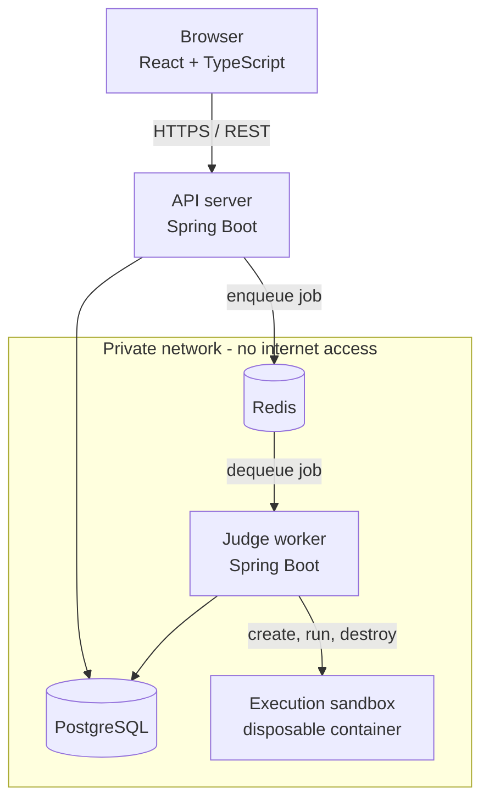

# CodeArena

An online judge platform: users solve algorithmic problems, submit code in C++, Java or
Python, and receive a verdict from a judge that compiles and runs their program inside a
disposable, network-isolated container under enforced CPU, memory and wall-clock limits.

The interesting part of this project is not the CRUD. It is everything around it —
asynchronous job processing, sandboxed execution of untrusted code, queue reliability,
idempotency and concurrency control.

> **Project status: Phase 1 of 16 complete and verified.** Authentication, problems,
> submissions and the judge itself are the phases that follow. This README describes
> what exists today; it is updated at the end of every phase. Nothing below is
> aspirational — every claim here was executed, not assumed.

---

## Architecture



The rule the whole design serves: **the API server never executes user-submitted code.**
`POST /api/submissions` will persist a row, push a job onto Redis and return
immediately. All execution happens in a worker process, behind a queue, inside a
container that is destroyed afterwards.

See [docs/architecture.md](docs/architecture.md) for the component breakdown and
[docs/decisions.md](docs/decisions.md) for the engineering decisions and their
trade-offs.

---

## Tech stack

| Layer | Choice |
|---|---|
| Backend | Java 21, Spring Boot 3.5, Spring Web, Spring Data JPA, Actuator |
| Database | PostgreSQL 16, schema managed by Flyway |
| Cache / queue | Redis 7 (append-only persistence enabled) |
| Frontend | React 19, TypeScript, Vite, React Router, Axios |
| Execution | Docker, one disposable container per submission |
| Build | Maven 3.9 (multi-module reactor, wrapper committed), npm |
| API docs | OpenAPI 3 via springdoc, Swagger UI |
| Testing | JUnit 5, AssertJ, MockMvc, Testcontainers |

---

## Repository layout

```
codearena/
├── backend/            Spring Boot API server (owns the Flyway migrations)
├── worker/             Spring Boot judge worker
├── frontend/           React + TypeScript client
├── docs/               Architecture and decision records
├── pom.xml             Maven aggregator
├── docker-compose.yml  Full local stack
└── .env.example        Configuration template
```

---

## Running the stack

### Prerequisites

| Tool | Version | Needed for |
|---|---|---|
| Docker + Compose | Engine 24+, Compose v2+ | the whole stack; also for integration tests |
| JDK | 21 | building or running the JVM services outside Docker |
| Node | 20+ | building or running the frontend outside Docker |

Maven is **not** a prerequisite — the committed wrapper (`./mvnw`) fetches the pinned
version itself.

### With Docker (recommended)

```bash
cp .env.example .env
# Set POSTGRES_PASSWORD and JWT_SECRET - compose refuses to start without them.
# Generate a secret with:  openssl rand -base64 48

docker compose up --build
```

| Service | Where | Published to host |
|---|---|---|
| Frontend | http://localhost:5173 | yes |
| API | http://localhost:8080 | yes |
| Swagger UI | http://localhost:8080/swagger-ui.html | yes |
| API health | http://localhost:8080/actuator/health | yes |
| Worker health | `:8081/actuator/health` on the internal network | no — serves no public traffic |
| PostgreSQL | `postgres:5432` on the internal network | no |
| Redis | `redis:6379` on the internal network | no |

PostgreSQL, Redis and the worker sit on a network declared `internal: true`. Docker
cannot publish a host port from such a network, which is the intended outcome: the
datastores are unreachable from the host and from the LAN. Inspect them from inside:

```bash
docker compose exec postgres psql -U codearena -d codearena
docker compose exec redis redis-cli
docker compose ps            # health of all five services
docker compose logs -f worker
docker compose down          # stop; add -v to discard the data volumes
```

The home page shows a live connectivity panel: if it reports the API server's name,
version and profile, the whole chain (browser → API → PostgreSQL → Redis) is working.

Startup is health-gated, not timing-based: the backend waits for PostgreSQL and Redis
to pass their health checks, and the worker additionally waits for the backend, because
the backend applies the database migrations. All five health checks probe `127.0.0.1`
rather than `localhost`, because in a container `localhost` can resolve to `::1` first
and a server bound to IPv4 only then looks dead.

### Without Docker

Requires JDK 21, Node 20+, and your own PostgreSQL and Redis reachable on localhost —
the compose datastores cannot be used here, because they sit on an internal-only
network and publish no host port. Maven is **not** required: the committed Maven
Wrapper (`./mvnw`) downloads the pinned version.

The connection defaults in `application.yml` point at `localhost:5432` and
`localhost:6379`; override with `DATABASE_URL`, `DATABASE_USERNAME`,
`DATABASE_PASSWORD`, `REDIS_HOST` and `REDIS_PORT` if yours differ.

```bash
# API server on :8080
./mvnw -pl backend -am spring-boot:run

# Judge worker on :8081
./mvnw -pl worker -am spring-boot:run

# Frontend dev server on :5173
cd frontend && npm install && npm run dev
```

---

## Configuration

No secret is committed and none is hardcoded. Every environment-specific value is read
from an environment variable with a development default; see
[.env.example](.env.example) for the full list.

| Variable | Purpose |
|---|---|
| `DATABASE_URL`, `DATABASE_USERNAME`, `DATABASE_PASSWORD` | PostgreSQL connection |
| `REDIS_HOST`, `REDIS_PORT`, `REDIS_PASSWORD` | Redis connection |
| `JWT_SECRET` | Token signing key (used from Phase 2) |
| `WORKER_CONCURRENCY` | Submissions judged in parallel per worker process |
| `CORS_ALLOWED_ORIGINS` | Explicit browser origin allow-list |
| `VITE_API_BASE_URL` | API base URL baked into the frontend bundle |

`docker-compose.yml` uses `${VAR:?message}` for `POSTGRES_PASSWORD` and `JWT_SECRET`, so
the stack fails loudly rather than silently starting with a default credential.

---

## Testing

```bash
./mvnw test      # unit tests only - no Docker daemon required
./mvnw verify    # adds the integration suite (Testcontainers: real PostgreSQL + Redis)
```

Unit tests (`*Test`) run under Surefire and have no external dependencies. Integration
tests (`*IT`) run under Failsafe against real containers — never an in-memory database,
because the system depends on real PostgreSQL behaviour. See ADR-003.

Current suite: 12 tests — 4 backend unit (the error contract), 3 worker unit
(configuration validation), and 5 integration that boot the API against a real
PostgreSQL and Redis and assert that Flyway applied the schema, both health indicators
report UP, the OpenAPI document is published, and unknown paths return the documented
error envelope.

Frontend:

```bash
cd frontend
npm run lint
npm run build   # type-checks with tsc, then bundles
```

---

## Security posture

In place and verified as of Phase 1:

- **Network isolation.** PostgreSQL, Redis and the worker sit on a Docker network
  declared `internal: true`. Containers on it get no default route, so an outbound
  connection fails with `Network unreachable` — confirmed against a raw IP, not just a
  hostname. No host port is published for either datastore.
- **No secrets in the repository.** `.env` is git-ignored; only `.env.example` is
  committed, with placeholders. Compose refuses to start if `POSTGRES_PASSWORD` or
  `JWT_SECRET` is unset rather than falling back to a default credential.
- **Containers run as a non-root user** (`uid=100 codearena`, confirmed at runtime),
  from a JRE-only runtime image carrying neither the JDK nor the build cache.
- **Errors leak nothing.** Stack traces are logged server-side and never serialised into
  a response; a unit test asserts the thrown exception's message is absent from the body.
- **CORS is an explicit origin allow-list**, never a wildcard.
- **Browser hardening headers** — `X-Content-Type-Options`, `X-Frame-Options`,
  `Referrer-Policy` — asserted present on responses, not merely configured (see ADR-009
  for why that distinction mattered).

Designed for, but **not yet implemented**:

- **The API server never executes user code.** The topology enforcing this — a separate
  worker, behind a queue — exists; the sandbox that runs submissions in a disposable,
  resource-limited container arrives in Phase 6.

Authentication and authorisation arrive in Phase 2, the execution sandbox and its CPU,
memory and timeout limits in Phase 6, and rate limiting in Phase 9. Each is documented
as it lands, never before.

---

## Roadmap

| Phase | Scope | Status |
|---|---|---|
| 1 | Repository, build, Docker stack, service skeletons | **Complete** |
| 2 | Users, roles, JWT access and refresh tokens | Next |
| 3 | Problems, tags, test cases, search and pagination | Planned |
| 4 | Submission API and state machine | Planned |
| 5 | Redis queue, worker loop, retries, idempotency | Planned |
| 6 | Docker execution engine, resource limits, isolation | Planned |
| 7 | Judging, output comparison, verdicts | Planned |
| 8 | Real-time submission status | Planned |
| 9 | Caching, cache invalidation, rate limiting | Planned |
| 10 | Contests, scoring, leaderboards | Planned |
| 11 | Full frontend | Planned |
| 12–16 | Hardening, testing, CI/CD, docs, deployment | Planned |

---

## Licence

[MIT](LICENSE)
