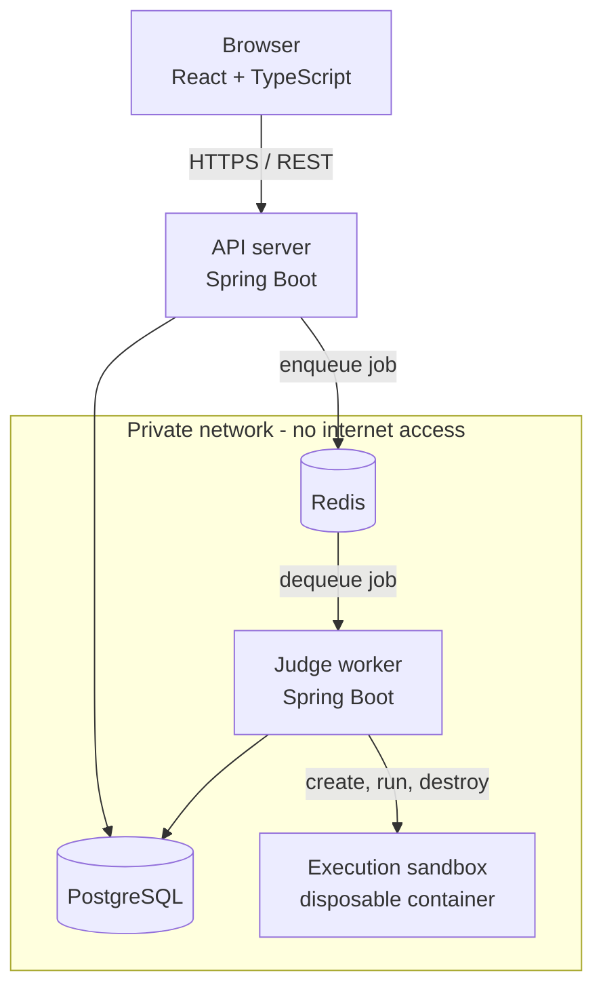
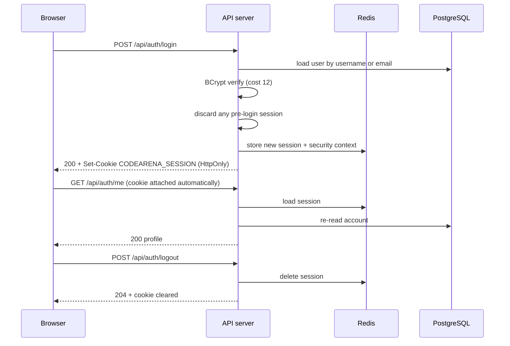

# Architecture

> Status: this document tracks what is **built**, and is extended at the end of every
> phase. Anything not yet implemented is listed under "Planned" rather than described
> as if it exists.

## Components

CodeArena is deliberately split into four runtime processes rather than one, because
they have incompatible risk profiles and scaling characteristics.

| Component | Responsibility | Why it is separate |
|---|---|---|
| **Frontend** | Rendering and client-side routing | Static assets; scales and deploys independently of the API |
| **API server** | REST API, authentication, persistence, enqueuing jobs | Must stay responsive; **never** executes user code |
| **Judge worker** | Consumes jobs, drives sandboxed execution, records results | CPU-heavy and untrusted-adjacent; scaled by queue depth, not by request rate |
| **PostgreSQL** | System of record | Relational, transactional data |
| **Redis** | Queue, cache, rate-limit counters | Low-latency, non-authoritative state |

The central architectural rule: **the API server never runs user-submitted code.** A
submission request writes a row, pushes a job and returns. Everything expensive and
everything dangerous happens in a worker, behind a queue.

## Networking

`docker-compose.yml` defines two networks:

- `edge` — the frontend and the API server. Ports published to the host come from here.
- `internal` — PostgreSQL, Redis and the worker, declared `internal: true` so Docker
  attaches no gateway. Containers on it cannot reach the internet and cannot be reached
  from outside the compose project.

The worker sits only on `internal` and publishes no ports.

PostgreSQL and Redis publish **no** host ports at all. This is a property of the
network, not just a policy: Docker cannot set up port publishing for a container whose
only network is `internal: true`, because there is no NAT for it. The datastores are
therefore unreachable from the host and from the LAN, and are inspected from inside the
network (`docker compose exec postgres psql …`). Verified by observation: a container on
`internal` has no default route at all — only its own subnet — so an outbound connection
to a raw IP fails with `Network unreachable`, not merely a DNS failure.

## Schema ownership

Flyway migrations live in the backend and run **only** in the backend
(`backend/src/main/resources/db/migration`). The worker has no migration tooling on its
classpath at all. This makes it structurally impossible for several worker replicas to
race each other to migrate the database. The worker runs with
`hibernate.ddl-auto: validate` and waits for the backend's health check before starting.

## Authentication

Sessions, not tokens. The browser holds an HttpOnly cookie carrying a session id; the
session itself lives in Redis under `codearena:session:*`. Spring Security's context is
persisted into that session, so an authenticated request is resolved by a Redis lookup
rather than by verifying a signature.

Two consequences worth naming:

- **Revocation is immediate.** Deleting the session in Redis ends access on the next
  request. `GET /api/auth/me` also re-reads the account rather than trusting the session
  copy, so a role change or a disabled flag takes effect at once instead of lingering
  until the session expires.
- **Redis is now on the authentication path.** If Redis is unavailable nobody can sign in
  and existing sessions stop resolving. This is accepted, and why, is recorded in ADR-010.

Sessions are why the API server stays horizontally scalable: any instance can serve any
request because none of them hold session state locally.

## Current state (Phase 2 — complete and verified)

Implemented:

- Maven multi-module build (`codearena-parent` → `backend`, `worker`), Java 21
- API server: `GET /api/system/info`, actuator health with database and Redis
  indicators, OpenAPI/Swagger UI, global exception handler, configurable CORS
- Worker: configuration binding with validation, fail-fast startup connectivity check
  against PostgreSQL and Redis, actuator health
- Frontend: Vite + React + TypeScript, router, isolated service layer, API
  connectivity panel with loading / connected / error states
- Full docker compose stack with health-gated startup ordering
- Flyway baseline migration

Added in Phase 2:

- `users` table (`V2`) with UUID public ids, functional unique indexes for
  case-insensitive identity, a role check constraint and audited timestamps
- Registration, login (by username or email), logout and current-user endpoints
- Spring Security with session authentication, CSRF, role-based rules and JSON error
  responses for 401 and 403
- Frontend auth context, protected routes, and login/register/profile pages

Verified by execution, not assumed: `./mvnw clean verify` passes (32 unit, 28 integration
against real PostgreSQL and Redis); all five compose services reach `healthy` with zero
restarts; Flyway records `V1` and `V2` as applied; logout is proven to invalidate the
session server-side by replaying the captured cookie; login gives identical answers for a
wrong password and an unknown account; and containers on the internal network have no
route off it.

Planned, in phase order: problems and test cases (3),
submission API and state machine (4), Redis queue and worker loop (5), Docker execution
engine (6), judging and verdicts (7), real-time status (8), caching and rate limiting
(9), contests and leaderboards (10).

## Related documents

- [decisions.md](decisions.md) — engineering decisions and their trade-offs
