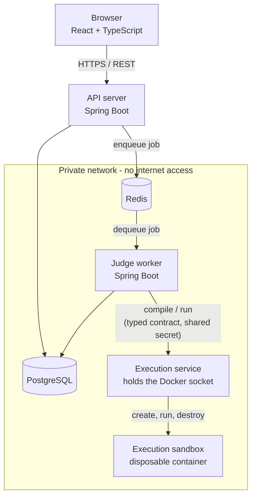
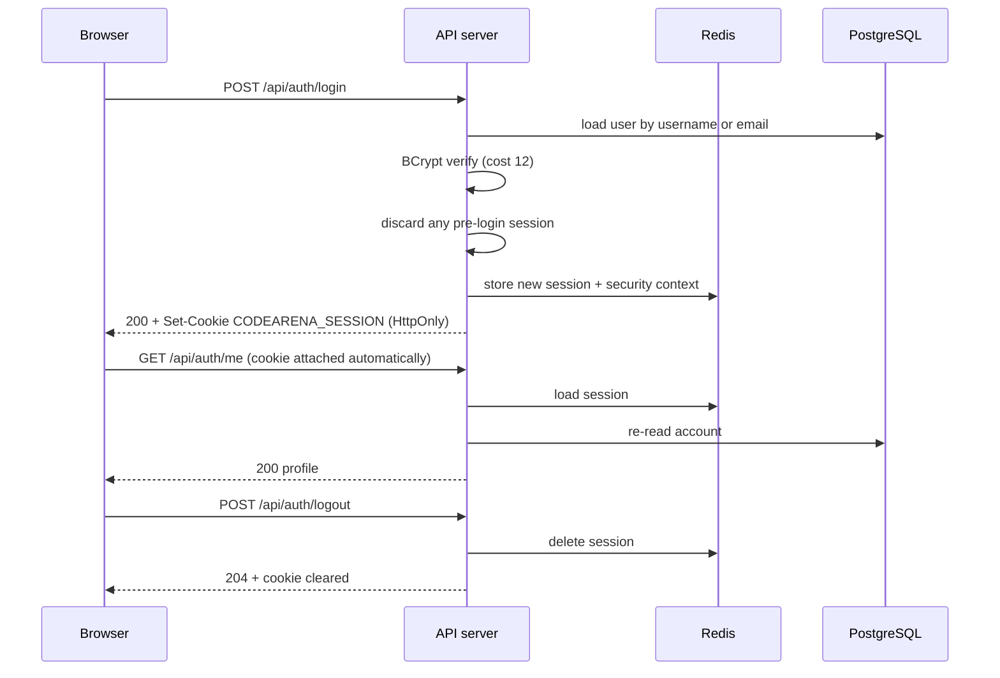
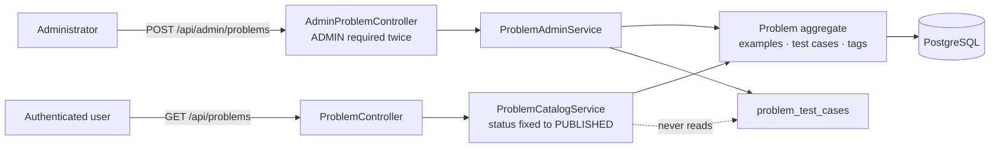
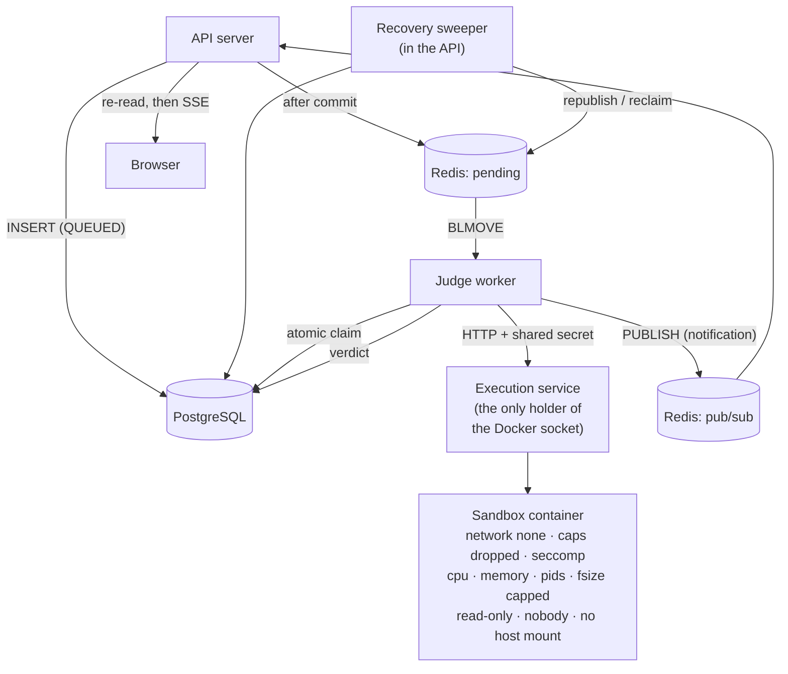

# Architecture

> Status: this document tracks what is **built**, and is extended at the end of every
> phase. Anything not yet implemented is listed under "Planned" rather than described
> as if it exists.

## Components

CodeArena is deliberately split into five runtime processes rather than one, because they
have incompatible risk profiles and scaling characteristics — and, in one case, incompatible
*authority*.

| Component | Responsibility | Why it is separate |
|---|---|---|
| **Frontend** | Rendering and client-side routing | Static assets; scales and deploys independently of the API |
| **API server** | REST API, authentication, persistence, enqueuing jobs | Must stay responsive; **never** executes user code |
| **Judge worker** | Consumes jobs, compares output, records verdicts | CPU-light but untrusted-adjacent: it parses program output. Scaled by queue depth, not request rate |
| **Execution service** | Creates, limits, runs and destroys sandboxes | **Holds the Docker socket.** Separated so that the authority to create containers is not held by anything that also touches the database, the queue or untrusted output |
| **PostgreSQL** | System of record | Relational, transactional data |
| **Redis** | Queue, notifications | Low-latency, non-authoritative state |

Two architectural rules hold this together.

**The API server never runs user-submitted code.** A submission request writes a row, pushes
a job and returns. Everything expensive and everything dangerous happens behind a queue.

**Only one process can create a container.** A Docker socket is host-equivalent, so the
process holding it does as little as possible: no database, no queue, no user model, four
typed endpoints, one caller. The worker asks it to "compile and run this source in one of
three languages within these limits" and cannot express anything else — no image, no mount,
no capability, no network. A compromised worker therefore inherits that narrow authority
rather than control of the host. See ADR-028 and
[threat-model.md](threat-model.md), which also states plainly what this does **not** fix.

## Networking

`docker-compose.yml` defines three networks:

- `edge` — the frontend and the API server. Ports published to the host come from here.
- `internal` — PostgreSQL, Redis and the worker, declared `internal: true` so Docker
  attaches no gateway. Containers on it cannot reach the internet and cannot be reached
  from outside the compose project.
- `sandbox` — also `internal: true`, and carrying exactly one conversation: worker to
  execution service. The executor is on this network **only**, so the process holding the
  Docker socket has no route to PostgreSQL or Redis and nothing it holds can be used to go
  looking for them.

Neither the worker nor the executor publishes a port.

PostgreSQL and Redis publish **no** host ports at all. This is a property of the
network, not just a policy: Docker cannot set up port publishing for a container whose
only network is `internal: true`, because there is no NAT for it. The datastores are
therefore unreachable from the host and from the LAN, and are inspected from inside the
network (`docker compose exec postgres psql …`). Verified by observation: a container on
`internal` has no default route at all — only its own subnet — so an outbound connection
to a raw IP fails with `Network unreachable`, not merely a DNS failure.

## Schema ownership

Flyway migrations live in the backend and run **only** in the backend
(`backend/src/main/resources/db/migration`). The worker has no migration tooling on its
classpath at all. This makes it structurally impossible for several worker replicas to
race each other to migrate the database. The worker runs with
`hibernate.ddl-auto: validate` and waits for the backend's health check before starting.

## Authentication

Sessions, not tokens. The browser holds an HttpOnly cookie carrying a session id; the
session itself lives in Redis under `codearena:session:*`. Spring Security's context is
persisted into that session, so an authenticated request is resolved by a Redis lookup
rather than by verifying a signature.

Two consequences worth naming:

- **Revocation is immediate.** Deleting the session in Redis ends access on the next
  request. `GET /api/auth/me` also re-reads the account rather than trusting the session
  copy, so a role change or a disabled flag takes effect at once instead of lingering
  until the session expires.
- **Redis is now on the authentication path.** If Redis is unavailable nobody can sign in
  and existing sessions stop resolving. This is accepted, and why, is recorded in ADR-010.

Sessions are why the API server stays horizontally scalable: any instance can serve any
request because none of them hold session state locally.

## Problem catalogue

Problems are an aggregate: a `Problem` owns its examples, its test cases and its tags, and
they are replaced wholesale on edit and deleted with it. Modelling it that way — rather
than as three independently-managed repositories — means an edit cannot leave a problem
holding examples that belonged to a previous version of itself.

The security boundary of this phase is the split between **examples** and **test cases**.
They are separate tables mapped to separate response types, so the user-facing
`ProblemDetailResponse` has no field capable of carrying an answer key. A single table with
a `visibility` flag would have worked too, but then every user-facing query would need a
predicate, and one forgotten predicate ships the answers.

Status is not a writable property. It changes only through `publish`, `unpublish`,
`archive` and `restore` on the entity, each of which consults `ProblemStatus` for whether
the move is legal, and `publish` additionally refuses an incomplete problem. Since
`ProblemRequest` has no status field, there is no payload a client can send that reaches
the catalogue without passing those checks.

## The judging pipeline

The API server and the judge worker are separate processes for one reason: the API must
never execute user code. `POST /api/submissions` writes a row, asks for it to be queued, and
returns. Everything expensive and everything dangerous happens elsewhere.

Four properties hold this together:

- **The submission row is the outbox.** Creating a submission and recording that it needs
  queueing are one INSERT, so there is no state in which one exists without the other.
- **The claim is atomic.** `UPDATE … WHERE status = 'QUEUED'` lets exactly one worker win,
  so duplicate delivery is a no-op rather than a double execution.
- **Terminal is terminal.** Nothing leaves a verdict, so a straggling worker cannot
  overwrite a newer result.
- **The worker cannot create a container.** It asks the execution service to, over a contract
  with no field for an image, a mount, a capability or a network, and with limits clamped on
  arrival. The worker image contains no Docker client at all.

### The sandbox boundary

Everything about a sandbox container is decided in one class, `SandboxPolicy`, so that the
security boundary can be read on one screen rather than reconstructed from the middle of
process-handling code. `SandboxPolicyTest` asserts the argument list; `SandboxSecurityIT`
asserts the behaviour by running real malicious programs — a fork bomb, an allocation storm,
a network probe, an environment dump, a privilege-escalation attempt — and checking what
actually happened. Only the second kind is evidence: a flag in a list proves nothing about
the kernel.

Cleanup is layered, because a `finally` cannot cover a process that is killed. Containers and
volumes are removed on every path out of an execution; `WorkspaceRegistry` closes workspaces
whose caller vanished and closes all of them on shutdown; `SandboxReaper` sweeps strays by
label at startup and on a timer, constructed so that it can never remove a live execution's
resources.

The worker uses plain JDBC rather than the API's JPA entities (ADR-022), and the two
services share only `Language`, `SubmissionStatus` and the event record — the rules both
must agree on.

### Getting the verdict to the browser

A fourth property governs the return path: **Redis carries a notification, never the state.**
The worker publishes three fields — submission, status, timestamp — to one channel. Every
API instance subscribes, and an instance that has a browser watching that submission
**re-reads the row from PostgreSQL** and streams the result of that read over SSE. The
published payload is never forwarded.

That is what lets the design work behind a load balancer without sticky sessions, and what
keeps Redis out of the trust path: the notification can be duplicated, reordered or lost
entirely without a browser ever being shown a status the database does not hold.

Delivery is **at-least-once and best-effort, not exactly-once**. It is made safe by a
snapshot on connect, a convergent client reducer that ignores anything not strictly newer,
and a bounded fallback poll armed only when the stream fails. See
[submission-lifecycle.md](submission-lifecycle.md) and ADR-023/ADR-024.

## Current state (Phase 8 — complete and verified)

Implemented:

- Maven multi-module build (`codearena-parent` → `backend`, `worker`), Java 21
- API server: `GET /api/system/info`, actuator health with database and Redis
  indicators, OpenAPI/Swagger UI, global exception handler, configurable CORS
- Worker: configuration binding with validation, fail-fast startup connectivity check
  against PostgreSQL and Redis, actuator health
- Frontend: Vite + React + TypeScript, router, isolated service layer, API
  connectivity panel with loading / connected / error states
- Full docker compose stack with health-gated startup ordering
- Flyway baseline migration

Added in Phase 2:

- `users` table (`V2`) with UUID public ids, functional unique indexes for
  case-insensitive identity, a role check constraint and audited timestamps
- Registration, login (by username or email), logout and current-user endpoints
- Spring Security with session authentication, CSRF, role-based rules and JSON error
  responses for 401 and 403
- Frontend auth context, protected routes, and login/register/profile pages

Added in Phase 4:

- `common` module: `Language` and `SubmissionStatus`, shared by both deployables
- `submissions` (`V4`), doubling as the transactional outbox
- Submission API, Redis queue, publication-after-commit and a recovery sweeper
- Judge worker: atomic claim, Docker execution, verdict mapping, bounded retries
- Frontend solve page with a code editor and verdict display

Added in Phase 3:

- `problems`, `problem_examples`, `problem_test_cases` and `problem_tags` (`V3`), with
  a UUID public id, a unique slug, check constraints mirroring every enum, and composite
  indexes over the catalogue's actual access path
- Admin authoring and lifecycle endpoints; public catalogue and detail endpoints
- Database-level pagination, filtering and search with a closed sort vocabulary
- Frontend catalogue, problem detail, and the admin authoring and management screens

Added in Phase 5:

- `submission_test_results` (`V5`): per-test outcome, runtime and a denormalised `hidden`
  marker, with **no column capable of holding test data**; plus a composite index over the
  history page's actual access path (`user_id`, `status`, `created_at DESC`)
- Submission history with server-side filtering by problem, verdict and language, paginated,
  backed by a constructor projection so a listing never reads `source_code` at all
- `GET /api/submissions/{id}/events`: Server-Sent Events, authorised identically to the REST
  endpoint before the first byte, snapshot first, stream closed at the verdict
- Redis Pub/Sub notifications from the worker; every API instance subscribes and **re-reads
  PostgreSQL** rather than forwarding the payload, so the design survives a load balancer
  without sticky sessions and keeps Redis out of the trust path
- A convergent client reducer plus a bounded fallback poll, replacing Phase 4's
  unconditional polling
- Frontend test suite (Vitest + Testing Library): 25 tests, specifying the convergence rules
  and the colour-independence of the verdict display

Added in Phase 6:

- A separate `executor` service holding the Docker socket, exposing four typed
  operations that cannot name an image, a mount, a capability or a network; the worker
  image no longer contains a Docker client at all (ADR-028)
- `SandboxPolicy`: every container flag in one readable place, plus a custom seccomp
  allowlist, private IPC and cgroup namespaces, `--pull never`, RLIMIT ceilings and a
  fully pinned environment
- Sandbox images built from digest-pinned bases with package managers, network tooling
  and every setuid bit removed, asserted at build time
- A reaper for stray containers and volumes, and OOM detection by asking the daemon
  rather than guessing from exit code 137

Added in Phase 7:

- `contests`, `contest_problems`, `contest_participants` (`V6`), plus a nullable
  `contest_id` on submissions — null means practice, so every pre-existing row is already
  correct and no backfill was needed
- A contest's visible status is **computed** from its lifecycle, schedule and the clock
  rather than stored, so a contest ends on time whether or not anything is running to
  notice it (ADR-032)
- Registration, with the duplicate prevented by a unique constraint rather than by a
  check that two concurrent requests can both pass
- Contest submissions through the **existing** queue, worker and sandbox — one execution
  path, with the contest's eligibility rules in front of it
- ICPC-style scoring computed from persisted submissions per request, with no stored
  score to fall out of step (ADR-034)
- Contest, contest-solve, standings and admin contest pages, with a server-corrected
  countdown

Added in Phase 8:

- `audit_events` (`V7`): an append-only record of security-sensitive and administrative
  events, with a database trigger that refuses UPDATE and DELETE outright
- Audit events for authentication, problem and contest lifecycle, contest registration,
  submission creation and denied administrative requests — and deliberately **not** for
  reads, which are the bulk of traffic and change nothing
- Administrative mutations record in the caller's transaction, so a success event cannot
  outlive a rolled-back change and a change cannot commit unaudited (ADR-037)
- Curated metadata with redaction, truncation and bounds, so an audit row cannot become
  a credential leak
- A request id linking application logs to audit events, sanitised because a client may
  supply it
- An ADMIN-only audit search with a closed sort whitelist, and a curated operational
  status endpoint that is deliberately not an Actuator dump (ADR-038)
- Actuator health details restricted to administrators: they were disclosing the Redis
  version, the database engine, the container path and host disk figures to anonymous
  callers

Verified by execution, not assumed: `./mvnw clean verify` passes against real PostgreSQL,
Redis and **real Docker containers**, alongside the frontend suite; every compose service
reaches `healthy` with zero restarts; Flyway records `V1` through `V6` as applied; a draft answers 404 rather than 403 to a normal user; the raw catalogue response is
asserted to contain neither a hidden test case's input nor its expected output; a `status`
field added to an update payload is ignored; and every admin mutation returns 403 to a USER
and 401 to an anonymous caller.

Phase 8 adds to that: an audit event cannot be updated or deleted, including by a blanket
DELETE; a success event written in a transaction that rolls back does not survive;
a failure event written independently does survive its caller's rollback; recording
outside a transaction fails loudly; a password never reaches the audit table; a failed
login records the same reason for a real account and an imaginary one; ordinary reads
produce no events; the audit API answers 401 to anonymous callers and 403 to users; every
sort outside the whitelist is refused; injection attempts in filters are treated as
ordinary values; and the status endpoint mentions no credential, path or configuration.

Phase 7 adds to that: a draft contest answers 404 to a normal user on both the detail and
the standings endpoints; registration is refused once a contest starts; a submission is
refused before the start, after the end, without registration, and to a published problem
that is simply not in that contest; eight concurrent registrations produce exactly one row;
a SYSTEM_ERROR never adds penalty; a resubmitted solve never scores twice; and the
standings response is asserted to carry no email address and no source code.

Phase 5 adds to that: the SSE endpoint answers 404 — not 403, and not a JSON envelope that
`Accept: text/event-stream` cannot negotiate — for a submission belonging to someone else;
a stream opened on an already-terminal submission sends one snapshot and closes rather than
hanging; the history listing is asserted to carry no source code for any row; and the
convergence reducer is proven against duplicate, reordered, lost and unparseable events.

**Contests add no new execution path.** A contest submission is an ordinary submission
with a contest attached: same table, same status machine, same queue, same worker, same
sandbox. A second engine for contests would be a second place for a judging bug to live,
and the one that ran less often would be the one nobody noticed was broken.

**Auditing is a record, not a source of truth.** Domain state stays in the domain tables;
audit events describe changes and never define them. Nothing is reconstructed from the
log, and CodeArena is not an event-sourced system (ADR-036).

**Not implemented, and not claimed:** there is no client IP in audit records, no worker
heartbeat, no user administration, no audit retention tooling and no tamper-evidence
beyond access control; no alerting on suspicious patterns; and **no plagiarism detection
and no anti-cheat
of any kind** — nothing compares submissions between contestants; there is no scoreboard
freeze, no late registration, no team contests and no ratings; there is no submission rate
limiting; the SSE connection cap is global rather than per user; memory is enforced but
not measured; there is no dead-letter queue for inspection; and the sandbox, though
hardened in Phase 6, still shares the host kernel and its execution service still holds a
Docker socket. Event delivery is at-least-once and best-effort, not exactly-once, and
real-time delivery is not guaranteed. See docs/security.md, docs/threat-model.md and
docs/contests.md.

Planned, in phase order: worker scaling and queue observability (8), caching, profiles
and statistics (8), rate limiting (9), contests and leaderboards (10), full frontend (11),
sandbox hardening (12).

## Related documents

- [decisions.md](decisions.md) — engineering decisions and their trade-offs
