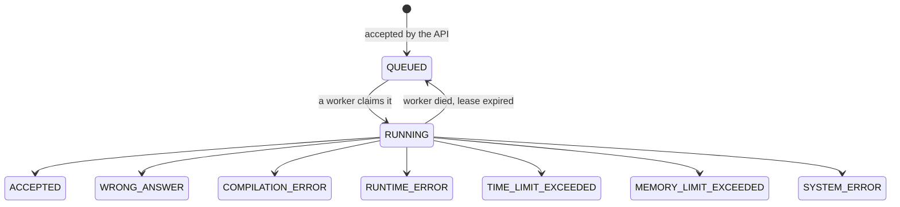

# Submission lifecycle

From a click on Submit to a verdict, and what happens when each part of that fails.

---

## The path

```mermaid
sequenceDiagram
    participant B as Browser
    participant A as API server
    participant P as PostgreSQL
    participant R as Redis
    participant W as Worker
    participant X as Execution service
    participant S as Sandbox container

    B->>A: POST /api/problems/{id}/submissions
    A->>P: INSERT submission (QUEUED, enqueued_at NULL)
    Note over A,P: one transaction; the row IS the outbox record
    A-->>B: 202 { submissionId, status: QUEUED }

    B->>A: GET /api/submissions/{id}/events (SSE)
    A->>P: SELECT status
    A-->>B: event: snapshot

    Note over A: after commit, never before
    A->>R: LPUSH pending {submissionId}
    A->>P: UPDATE enqueued_at = now()

    W->>R: BLMOVE pending → processing
    W->>P: UPDATE … SET RUNNING WHERE status = 'QUEUED'
    Note over W,P: atomic claim; exactly one worker wins

    W->>P: SELECT test cases
    W->>X: prepare / compile / run (typed contract, shared secret)
    Note over W,X: the worker cannot name an image,<br/>a mount, a capability or a network
    X->>S: create, compile, run per test
    S-->>X: stdout / exit code / kill reason
    X-->>W: execution result
    W->>P: UPDATE … SET verdict WHERE status='RUNNING' AND claimed_by=me
    W->>R: LREM processing

    W->>R: PUBLISH codearena:submissions:events
    R-->>A: {submissionId, status, occurredAt}
    Note over A,R: a doorbell, not a letter
    A->>P: SELECT status (re-read; payload never forwarded)
    A-->>B: event: submission
    A-->>B: stream closed (terminal)
```

---

## States



`RUNNING → QUEUED` is the only backwards move, and it exists because the alternative is a
submission stranded in RUNNING for ever after the process holding it was killed. **Nothing
leaves a terminal state**, which is what stops a straggling worker from overwriting a
verdict. Both properties are enforced in `SubmissionStatus.canTransitionTo` and asserted by
tests.

---

## Delivery semantics

**At-least-once, made safe by an idempotent claim.**

Exactly-once is not offered, because it cannot be: a worker can die at any instant,
including between taking a job and recording that it did. Instead, a duplicate delivery is
made harmless — the claim is a single statement,

```sql
UPDATE submissions SET status = 'RUNNING', claimed_by = ?, attempts = attempts + 1
WHERE public_id = ? AND status = 'QUEUED'
RETURNING …
```

so of two workers racing, exactly one sees a row and the other sees none and drops the job.
A read-then-update would let both proceed; this cannot.

---

## Live status delivery

The browser is told about a verdict over Server-Sent Events, with a bounded poll as the
fallback. Neither transport is trusted on its own.

**What is actually guaranteed.** The event that travels over Redis Pub/Sub is a
*notification*, not the state: three fields saying "submission X reached status Y at time Z".
The API instance that receives it **re-reads the submission from PostgreSQL** and sends the
result of that read. The payload is never forwarded to a browser.

This is **at-least-once, best-effort** delivery. It is **not exactly-once**, and it is not a
guarantee of real-time delivery:

- Redis Pub/Sub retains nothing. An API instance that is restarting when a message is
  published never sees it, and there is no replay.
- An event can arrive twice, or out of order, or after a later one.
- A proxy can strip the stream without either end noticing.

Four mechanisms make that safe rather than merely survivable:

| Mechanism | What it repairs |
|---|---|
| **Snapshot on connect** — every stream's first event is current state, read from PostgreSQL | A client that connected late, reconnected, or missed events while disconnected |
| **Convergent client reducer** — an event applies only if strictly newer; a terminal status absorbs everything after it | Duplicates, stragglers, out-of-order arrival; a client that saw ACCEPTED can never be walked back to RUNNING |
| **Bounded fallback poll** (2.5 s, armed only on stream failure, stops at the verdict) | A stream that died silently, an environment with no `EventSource`, a server at its connection cap |
| **Client watchdog** (5 min) | A submission that never settles; the UI says the submission is safe and to reload, rather than spinning for ever |

`applyStreamEvent` in `frontend/src/services/submissionStream.ts` is where convergence
actually lives, and its test file is the specification for it — every scenario in it is one
the transport can genuinely produce.

**PostgreSQL is authoritative throughout.** Redis holds the queue and carries notifications;
it is never asked what a submission's status is. Redis restarting with an empty keyspace
costs notifications and delayed browser updates, and costs no verdicts. The sweeper
(`SubmissionRecoverySweeper`) repairs the queue from the database, never the reverse.

**Where execution happens.** As of Phase 6 the worker does not create containers; it asks the
execution service to, over a contract that cannot express an image, a mount, a capability or
a network, and with limits clamped on arrival. The Docker socket lives only in that service.
See ADR-028 and [threat-model.md](threat-model.md).

**Shutdown.** Open streams are closed deliberately before the server begins its graceful
shutdown wait, because a stream is an in-flight request that is designed not to finish. That
alone turned out not to be enough — a stream whose browser has already gone away stays
counted as in-flight by Tomcat regardless — so the shutdown wait itself is bounded at five
seconds. Restarts are predictable rather than stalling for half a minute whenever the judge
is in use. ADR-027 has the measurement.

---

## The transactional outbox

The failure window between "committed to PostgreSQL" and "published to Redis" is real and
is not hand-waved.

**The submission row is the outbox record.** Creating a submission is one INSERT, so there
is no instant at which a submission exists without the record of its intent to be judged.
`enqueued_at` is the publication marker.

A separate outbox table was considered and rejected: it creates a second row describing the
same fact, which then has to be kept consistent with the first, and it makes the queue a
second source of truth. One row, one truth. (ADR-018.)

Publication happens **after commit**, never before. Publishing first would let a worker
claim a submission that does not exist yet or is about to roll back. Publishing after means
the opposite failure — row exists, push never happened — and that one is recoverable,
because the row records that it was never published.

The push happens **before** the marker is written. A crash between them republishes, which
is a harmless duplicate; the reverse order would mark a submission published that never
reached Redis, and nothing would ever notice.

---

## Failure scenarios

| Failure | What survives | Recovery |
|---|---|---|
| API dies between commit and push | Row in QUEUED, `enqueued_at` NULL | Sweeper republishes |
| Redis restarts and loses the list | Row in QUEUED, `enqueued_at` stale | Sweeper republishes after `publish-stale-after` |
| Worker dies before claiming | Row still QUEUED; job orphaned in `processing` | Sweeper republishes |
| Worker dies mid-execution | Row RUNNING with an expiring lease | Sweeper returns it to QUEUED (`attempts` already incremented) |
| Worker dies after writing the result | Row terminal | Redelivery finds it non-QUEUED and drops the job |
| Job delivered twice | — | Second claim matches no row; no-op |
| Submission repeatedly kills its worker | `attempts` climbs | After `max-attempts` (3) the sweeper records SYSTEM_ERROR |
| Docker unreachable | Row RUNNING with an expiring lease | The executor reports unhealthy; executions fail; the worker keeps consuming |
| Executor unreachable or at capacity | Row RUNNING with an expiring lease | **Deferred, not failed.** No result is recorded, so the sweeper requeues it — see below |
| Executor killed mid-execution | Row RUNNING; container and volume orphaned | Sweeper requeues the submission; the executor's reaper removes the strays on its next sweep |

---

## Retries

Retried: **infrastructure failures only**, and only by the sweeper returning an unfinished
submission to the queue, bounded by `attempts`.

### Deferral: when no sandbox could be obtained

There is a case that must not become a verdict at all. The execution service refuses work
beyond its configured ceiling of concurrent workspaces, answering 503 — and a machine that is
briefly full is not a statement about anybody's code.

So when a sandbox cannot be *obtained*, judging does not record a result:
`ExecutionUnavailableException` propagates, the row stays claimed with an expiring lease, and
the recovery sweeper returns it to the queue. This is deliberately the same path a worker
that died mid-execution takes, and it is bounded the same way — `attempts` was already
incremented when the submission was claimed, so after `max-attempts` the sweeper records
SYSTEM_ERROR rather than looping for ever.

The distinction is between *no sandbox was obtained* (nothing was judged; try again) and *the
sandbox existed and something went wrong with it* (INFRASTRUCTURE_FAILURE, and then
SYSTEM_ERROR). `JudgeFailureClassificationTest` pins both.

Never retried: WRONG_ANSWER, COMPILATION_ERROR, RUNTIME_ERROR, TIME_LIMIT_EXCEEDED,
MEMORY_LIMIT_EXCEEDED. These are *results*. Running the same program against the same tests
would produce the same verdict and simply burn a container doing it.

SYSTEM_ERROR is the honest terminal state when the judge gives up: it says the code was
never shown to be wrong, the infrastructure failed to find out.

---

## Judging

Compile once, then run once per test case, **stopping at the first failure** — the verdict is
already decided and continuing would only spend containers confirming it.

ACCEPTED requires every test to pass. The verdict names *which* test failed
(`failedTestIndex`) and nothing about its contents.

Per-test outcomes are recorded in `submission_test_results`: position, pass/fail, runtime,
and whether the test was hidden. **The table has no column that could hold test data**, so
there is nothing to filter on the way out (ADR-025). A NULL `runtime_ms` means the test never
ran — judging stopped before reaching it — which the UI shows as distinct from a failure. The expected output never enters the
sandbox: only the input is written to stdin, and comparison happens in the worker. A program
that could read the answer key could print it.

### Output comparison

Both sides are normalised identically, then compared exactly:

| Normalised away | Why |
|---|---|
| `\r\n` and `\r` → `\n` | A property of the author's editor, not their algorithm |
| Trailing whitespace on each line | `"3 "` and `"3"` are indistinguishable to a reader |
| Trailing blank lines | Whether the program used `println` or `print` is not what is tested |

Everything else is significant: whitespace **within** a line, leading whitespace, and blank
lines in the **middle** of the output. Collapsing internal spacing would let a program that
prints its numbers in the wrong columns pass, and output format is usually part of what a
problem specifies.

**No floating-point tolerance.** Applying an epsilon requires knowing the problem's intended
precision, and the problem model has no field for it. A default would accept wrong answers
on some problems and reject right ones on others.

The policy is pure and total — same inputs, same verdict, every time, with no clock, locale
or platform dependency — and `OutputComparatorTest` is its specification.
