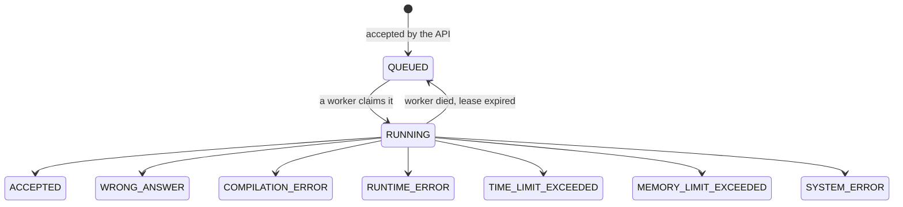

# Submission lifecycle

From a click on Submit to a verdict, and what happens when each part of that fails.

---

## The path

```mermaid
sequenceDiagram
    participant B as Browser
    participant A as API server
    participant P as PostgreSQL
    participant R as Redis
    participant W as Worker
    participant S as Sandbox container

    B->>A: POST /api/problems/{id}/submissions
    A->>P: INSERT submission (QUEUED, enqueued_at NULL)
    Note over A,P: one transaction; the row IS the outbox record
    A-->>B: 202 { submissionId, status: QUEUED }

    Note over A: after commit, never before
    A->>R: LPUSH pending {submissionId}
    A->>P: UPDATE enqueued_at = now()

    W->>R: BLMOVE pending → processing
    W->>P: UPDATE … SET RUNNING WHERE status = 'QUEUED'
    Note over W,P: atomic claim; exactly one worker wins

    W->>P: SELECT test cases
    W->>S: create, compile, run per test
    S-->>W: stdout / exit code / kill reason
    W->>P: UPDATE … SET verdict WHERE status='RUNNING' AND claimed_by=me
    W->>R: LREM processing

    B->>A: GET /api/submissions/{id} (polled)
    A-->>B: terminal status
```

---

## States



`RUNNING → QUEUED` is the only backwards move, and it exists because the alternative is a
submission stranded in RUNNING for ever after the process holding it was killed. **Nothing
leaves a terminal state**, which is what stops a straggling worker from overwriting a
verdict. Both properties are enforced in `SubmissionStatus.canTransitionTo` and asserted by
tests.

---

## Delivery semantics

**At-least-once, made safe by an idempotent claim.**

Exactly-once is not offered, because it cannot be: a worker can die at any instant,
including between taking a job and recording that it did. Instead, a duplicate delivery is
made harmless — the claim is a single statement,

```sql
UPDATE submissions SET status = 'RUNNING', claimed_by = ?, attempts = attempts + 1
WHERE public_id = ? AND status = 'QUEUED'
RETURNING …
```

so of two workers racing, exactly one sees a row and the other sees none and drops the job.
A read-then-update would let both proceed; this cannot.

---

## The transactional outbox

The failure window between "committed to PostgreSQL" and "published to Redis" is real and
is not hand-waved.

**The submission row is the outbox record.** Creating a submission is one INSERT, so there
is no instant at which a submission exists without the record of its intent to be judged.
`enqueued_at` is the publication marker.

A separate outbox table was considered and rejected: it creates a second row describing the
same fact, which then has to be kept consistent with the first, and it makes the queue a
second source of truth. One row, one truth. (ADR-018.)

Publication happens **after commit**, never before. Publishing first would let a worker
claim a submission that does not exist yet or is about to roll back. Publishing after means
the opposite failure — row exists, push never happened — and that one is recoverable,
because the row records that it was never published.

The push happens **before** the marker is written. A crash between them republishes, which
is a harmless duplicate; the reverse order would mark a submission published that never
reached Redis, and nothing would ever notice.

---

## Failure scenarios

| Failure | What survives | Recovery |
|---|---|---|
| API dies between commit and push | Row in QUEUED, `enqueued_at` NULL | Sweeper republishes |
| Redis restarts and loses the list | Row in QUEUED, `enqueued_at` stale | Sweeper republishes after `publish-stale-after` |
| Worker dies before claiming | Row still QUEUED; job orphaned in `processing` | Sweeper republishes |
| Worker dies mid-execution | Row RUNNING with an expiring lease | Sweeper returns it to QUEUED (`attempts` already incremented) |
| Worker dies after writing the result | Row terminal | Redelivery finds it non-QUEUED and drops the job |
| Job delivered twice | — | Second claim matches no row; no-op |
| Submission repeatedly kills its worker | `attempts` climbs | After `max-attempts` (3) the sweeper records SYSTEM_ERROR |
| Docker unreachable | — | SYSTEM_ERROR for that submission; the worker keeps consuming |

---

## Retries

Retried: **infrastructure failures only**, and only by the sweeper returning an unfinished
submission to the queue, bounded by `attempts`.

Never retried: WRONG_ANSWER, COMPILATION_ERROR, RUNTIME_ERROR, TIME_LIMIT_EXCEEDED,
MEMORY_LIMIT_EXCEEDED. These are *results*. Running the same program against the same tests
would produce the same verdict and simply burn a container doing it.

SYSTEM_ERROR is the honest terminal state when the judge gives up: it says the code was
never shown to be wrong, the infrastructure failed to find out.

---

## Judging

Compile once, then run once per test case, **stopping at the first failure** — the verdict is
already decided and continuing would only spend containers confirming it.

ACCEPTED requires every test to pass. The verdict names *which* test failed
(`failedTestIndex`) and nothing about its contents. The expected output never enters the
sandbox: only the input is written to stdin, and comparison happens in the worker. A program
that could read the answer key could print it.

### Output comparison

Both sides are normalised identically, then compared exactly:

| Normalised away | Why |
|---|---|
| `\r\n` and `\r` → `\n` | A property of the author's editor, not their algorithm |
| Trailing whitespace on each line | `"3 "` and `"3"` are indistinguishable to a reader |
| Trailing blank lines | Whether the program used `println` or `print` is not what is tested |

Everything else is significant: whitespace **within** a line, leading whitespace, and blank
lines in the **middle** of the output. Collapsing internal spacing would let a program that
prints its numbers in the wrong columns pass, and output format is usually part of what a
problem specifies.

**No floating-point tolerance.** Applying an epsilon requires knowing the problem's intended
precision, and the problem model has no field for it. A default would accept wrong answers
on some problems and reject right ones on others.

The policy is pure and total — same inputs, same verdict, every time, with no clock, locale
or platform dependency — and `OutputComparatorTest` is its specification.
